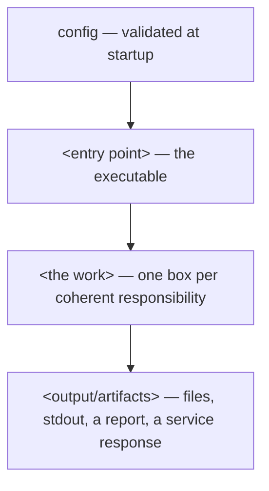
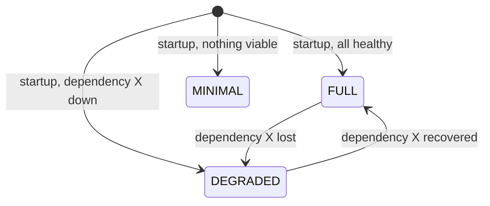
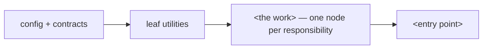

# **CORE LOGIC OF <PROJECT NAME> Mk I Mod 1 A0**

> **[STC template — delete this callout before use.]** This is the STANDARD TEMPLATE CONSTRUCT (STC) skeleton for a project's Logic document. Every `<ANGLE_BRACKET>` is a placeholder to fill in. Every `[STC: ...]` line is an instruction to yourself, not document content — delete it once the section is written.
>
> **Read §0.1 (Project Profile) before anything else, and delete before you fill.** Most sections in this skeleton are **[PROFILE]** sections: they exist only for projects that genuinely have that concern. Their default is **absent**. A small script and a distributed platform are both valid STC projects; the difference shows up as *sections that were deleted*, not as sections left full of unfilled placeholders. Deleting an inapplicable section is the standard working correctly — **not** cutting corners.
>
> The one thing you may never delete for convenience: a section your profile says applies. Effort is not a reason; the freeze is the point.
>
> **Deleting is about breadth, never about depth.** The profile removes *structures this project does not have*. It says nothing about how thoroughly to describe the ones it does — and the answer there is: **as thoroughly as the decisions genuinely are.** A complex system belongs in a long document, with §3.3 running to twenty or more module subsections, some of them pages deep. A thin description of a real module is where a Builder starts inventing, and that is the failure this whole standard exists to prevent. Short because there is less system: correct. Short because writing it was work: a defect.

## **0. About This Document**

**NATURE:** This is a **LOGIC document**, not an implementation. It describes the *what* and the *why* (flow, intent, contracts, invariants) of `<PROJECT NAME>`. It deliberately contains **no ready-to-paste implementation code**. Any code-like fragment is either (a) a declarative contract in an appendix, or (b) explicitly marked *illustrative, non-normative*. Concrete implementations are produced later, from `Railroad.md`, in dependency order — not from this file.

**WHY NO CODE HERE:** [STC: keep this rationale or replace with your own — the point is that bundling implementation into the logic doc lets a coding agent (or a rushed contributor) copy a half-thought-out algorithm instead of building against a frozen contract. This file freezes **interfaces and invariants**, not algorithms.]

**WHERE THIS CAME FROM (`Specification.md`, now in `ARCH/`):** this document was opened from an owner-authored specification — a plain-language description of what was wanted, with a numbered feature list. **That file is frozen and is not a source of truth here.** Two consequences worth stating so nobody has to guess later. First, **every `F#` from it is either honoured somewhere in §3, or named in §13 as deferred, or recorded below as dropped with a reason** — a feature that quietly vanished between the two documents is the one failure this handover has, and this line is what prevents it. Second, all further refinement of the business logic happens **here**, including the parts the owner had not thought about; going back to edit the specification would destroy its only remaining value, which is being an unedited record of the original ask.

`<Dropped or reinterpreted features: F#, what changed, and why — the owner agreed to each of these.>`

**The handover map — where each part of the specification landed.** This table is for whoever writes this document, and it is deliberately *not* in the specification: the owner answered plain questions and should never have had to learn what a profile row is. Filling it in is what turns the handover from an act of interpretation into an act of transcription.

| In `Specification.md` | Lands here |
|---|---|
| §2 the premise, and its general rules | §1 (Design Principles) — the premise is where a principle comes from, and a principle nothing in the premise supports is one you invented |
| §3 the structure sketch | §2.1, as **input only**. It may be replaced entirely; where it is, say so in one line, because the owner drew it for a reason and deserves to know the reason failed |
| §4's walkthroughs | §3.3 (per module) and §8.5 (the end-to-end flow); the owner's branches become the decisions, and their reasoning becomes the *why* |
| §4's "in case of failure or error" | §9.3's failure matrix, and §3.3's failure behaviour |
| the figures written into §4's steps ("how many arrive, how often, how big") | Appendix C (as pinned values) — and the absence of a figure is a **question to ask**, never a number to invent. The specification has no separate field for these; they arrive inside the step that carries them, so read the walkthroughs for numbers rather than expecting a list |
| §5's `F#` items | §3.2/§3.3, and each one keeps its `F#` so it stays traceable. Each item names the §4 walkthrough that delivers it, which is the owner's own coverage check — an item marked as a property rather than a sequence is the one legitimate exception |
| §6.1 (must never) | §3.5 (rules the system must never break) |
| §6.2 (not in this version) | §13 (Deferred) |
| §6.3 (imposed anyway) | §0 TARGET ENVIRONMENT and Appendix C — **flagged as choices**: each one may be challenged here with a cost attached, and the owner decides. This is the one list in the specification allowed to name a technology, a machine or a place, so it is also the only place a toolchain preference can legitimately have arrived from |
| §7's questions | **the profile in §0.1** — "should it run by itself" seeds P6b/P7, "what starts it" and "who or what receives the result" seed P1a/P1b, "what information does it touch" seeds P10, "when something fails, what do you prefer" seeds §9, and a judged "expected result" in §5 seeds P11 |
| §7's "where will it end up running" | §0 TARGET ENVIRONMENT — **as terrain, not as a choice**. The distinction is load-bearing: a §6.3 constraint may be revisited with a price attached, terrain may only be designed around. Keep the two apart here too, so a later reader can tell which assumptions are negotiable |
| §7's "where will it be built" | `codex/DevLog.md`'s machine-notes table, seeded on day one rather than discovered in the third session — and §0's one re-litigated decision about the environment, if the build machine and the target differ |
| §9 open questions | either resolved here as a decision with its reasoning, or carried into §13 — never left open in both documents |
| §11 (further development plans) | **nowhere structural.** Record it in §0 as known direction and treat it as non-normative: it may break a tie between two otherwise-equal designs by picking the one that does not foreclose it, and it may **never** be cited as the reason an abstraction, a flag, an extension point or a spare layer exists today. It is not deferred work, so it does not belong in §13 either — nobody asked for it. A line there that named a specific engine was a choice in disguise and belongs in §6.3 |

**THE BUILDER'S NOTEBOOK (`codex/DevLog.md`):** the Builder keeps an append-only journal of what it did, what broke, and what state it left the tree in — the one file it may write. **It is never law and never a decision.** If something in it turns out to matter, it is promoted into *this* document as an amendment, or into `Railroad.md` as a step, and only then does it bind anything. A missing decision is still a `CONTRACT-GAP`, never a log entry.

**COMPANION ARTIFACT (`Railroad.md`):** Once this logic is "locked", `Railroad.md` sequences component creation in dependency order, using the contract/ownership map in Appendix B as the single source of truth. **The division is strict: this file answers WHY and WHAT; the railroad answers WHAT TO GENERATE, step by step.** This file therefore carries the reasoning, the file architecture (§2.1) and the module-by-module application logic (§3) — and never a line of implementation code. The railroad carries ordered steps and verbatim signatures — and never a decision. A logic document that has started to read like a prompt for a code generator has failed; so has a railroad that decides anything.

**RESEARCH SOURCES — AI/LLM projects [STC: delete this whole block if the project has no AI/LLM component]:** while *authoring* this document, the curated **skill base** may be consulted for prior art on agent design, tool/function calling, RAG, memory, MCP, orchestration, evaluation, and agent persistence schemas. Authoring is the *right* phase for that research — decisions are still open here.

- **Availability check, once, before you plan around it.** Preferred entry point is the user-scoped **`skill-base` skill**, reachable from any project; it carries the registry and the query recipes. If the skill is not present, look for the vault at `G:\Mój dysk\DEV DEPARTMENT GD\AI-LLM\ObsiClaude` — vault present but skill missing just means this machine was never bootstrapped (`bootstrap/install-skill-base.ps1` restores it in seconds; propose, don't run unasked). **If neither resolves, ask the operator whether they have access to it and where it lives** — do not conclude it is gone from a failed path check (spaces, a non-ASCII character, a per-machine drive letter, an unmounted Drive). Its absence is never a blocker. Record the answer here so it is not re-asked every session — but never in `dependency.md` / `requirements.<ext>`: the delivered system must not depend on it.
- **Query graph-first, in two layers, never by bulk-reading.** For the *why* (principles, pitfalls, which source covers X) grep the curated theory index `REPOS/AID4-SKILL/knowledge-graph/graph.json` by concept id, then only the files it names. For the *how* (working implementations, call graphs, what-calls-what across the reference corpora) query the code graph — `graphify query|explain|path --graph ~/.graphify/global-graph.json` — which is a local traversal at zero model cost. Ground the design in the *why* layer, then find the implementation via the *how* layer.
- **Cite what you take.** A decision sourced from the base names its source file in the section that carries it. Traceability is the whole point of a curated base — and an uncited borrowing is indistinguishable from an improvisation.
- **Standing changes at the freeze.** Once this document is frozen the base becomes reference-only and can never override a frozen contract (`Railroad.md` §0, rail 4). Whatever it taught you must be **written into this document as a decision**, because the builder rides this file, not the research behind it. Likewise, never mirror a reference architecture wholesale — a queryable graph over someone else's system makes copying it *easier*, which is exactly what the interface freeze exists to prevent.

**VERSION LABELING:** The `Mk <N>` (Mark) designation is fixed for this project's fundamental generation and cannot change without starting a new project. Below it:
- **Mod (Modification)** — bumped on a *fundamental change in logic* (architecture, a tier added/removed, a core invariant reversed).
- **A (Alteration)** — bumped on a *smaller change within the same logic* (a clarification, a missing contract filled in, a parameter pinned, a contradiction resolved).

This file is `Mk <N> Mod <M> A<K>`: <one-sentence description of what this specific revision changed and why — see the Document Revision History section for the full log>.

**BUILT AGAINST STC `Mk <…> Mod <…> A<…>`** (also recorded in §0.1 beside the Pattern). The standard versions itself, and **a change to STC is never retroactive** — without this line, "this project follows STC" means "it follows whatever STC happens to be today", and every future edit to the standard silently invalidates this document. Migrating to a newer standard version is a deliberate decision by this project's owner, taken as a Mod bump here, never something that happens to the project while it sleeps.

**AMENDMENT & AUDIT DISCIPLINE:** this document is amended by **audits**, and an audit is worth only as much as the criterion it declares. Every amendment states in its Revision History entry **which audit produced it** and **what criterion that audit read against** — because "is this design good?" and "can each stated effect actually be reached from what is frozen?" are different questions that find disjoint sets of defects. Five audits are worth naming; a project will not run all of them at every bump, but it should know which one it just ran. The first four are what an Architect reads on paper and are the ones `Railroad.md` R8.1 asks you to declare; the fifth belongs to the owner and cannot be run by whoever wrote the document:

| Audit | Reads | Finds what the others cannot |
|---|---|---|
| **Consistency** | this file against itself, and against `Railroad.md` | two sections that disagree; a diagram that under-draws a contract; a heading broader than the axis it governs |
| **Reachability / provisioning** | every stated effect against the frozen surface | structures that are fully specified and have **no configured source** — a config key with no consumer, a singleton nothing populates, a rule that reads a state field which does not exist, a component whose stated job nothing can invoke |
| **Mechanical-ness** | every step's body against what this file pins | pinned structure with an unpinned *number, formula, ordering rule or free-form shape* behind it — the rail 6 class, and the one a consistency pass reads straight past |
| **Build** | the code of the first built chapters against this file | what no paper audit can see: what the Builder had to invent to make a step actually run |
| **Owner annotation** | the project owner reading this file and writing in the margin | over-claims, undefined units, and the questions this document silently leaves to its reader |

[STC: four rules that stop amendments from re-opening the same wounds.
**(1) Additive by default.** An A-bump *adds* surface; it does not reopen a frozen signature. If the fix genuinely requires reopening one, that is a **Mod**, and the entry says so rather than smuggling it in as a clarification.
**(2) A defect class is not retired by the amendment that names it.** Expect the class you just closed to reappear **inside the sections your own amendment added** — a new section is written in the same session, under the same blind spot, as the one that produced the original instance. So: every section an amendment adds is re-read for the same defect before the bump closes, and each closed class earns a **standing check** rather than a one-off correction. At Pattern II and III that re-read is the checklist in `Railroad.md` Appendix R8; at Pattern I, where that appendix does not exist, it is one deliberate pass over what you just wrote — the obligation is the re-read, not the apparatus.
**(3) Retrofits owed to the other document are named, not remembered.** A contract change lands here as an A-bump; the build-side consequences (a step that must now load a value, a gate that moved, an owner for a new symbol) are **listed by name at the end of the entry** as owed to `Railroad.md`. An unlisted consequence is a consequence nobody will do.
**(4) An amendment lists the `V#` it INVALIDATES, by number.** Rule 3 covers work the bump *creates*; this one covers work it *destroys*, and the two fail differently. A forgotten retrofit simply does not happen and is visible as an absence. **A criterion left standing after the rule beneath it moved is not an absence — it is an assertion of the previous law**, and it reads green precisely when the code is wrong, because the code satisfying it is the code the amendment just outlawed. So before closing any bump that touches a `§`, read every `V#` in `Railroad.md` citing that `§` and end the entry with the list — *"invalidates 1.5 V6, 2.3 V2; corrected wording owed to the Architect"*. A bump that changed a rule and invalidated nothing is a claim worth re-checking, not a clean result.]

**CLAIM DISCIPLINE — this document may not promise more than the design delivers.** Three shapes, all cheap to fix here and expensive once a Builder has read them:
- **Over-claim.** A sentence advertising a capability the design deliberately *refuses* (e.g. claiming a mechanism "prevents duplicate side effects on restart" in a system that guarantees nothing is re-run on restart). The claim is the defect, and **the fix is deletion, not machinery** — adding the capability to justify the sentence is how a document talks a project into work it decided against.
- **A heading broader than its axis.** A table column headed `writes` reads as *nothing is written here*, and some other section will contradict it, because something always writes for a reason the column never governed. Name the axis exactly (`writes: <the domain records this mode may create>`) and state what sits **outside** it and is therefore never suppressed by it. The general form of this defect: **a label that generalises one axis into all of them.**
- **A verb used as if it were a mechanism.** If a word like *alert*, *validate*, *retry* or *promote* appears repeatedly in the prose with no channel, key, symbol or delivery path behind it, the document has described a capability it does not have. Either give it one (a named mechanism, §9.4-style) or delete the verb — it is the single most common instance of the reachability class above.

**TARGET ENVIRONMENT:**
- **Runtime / language:** `<e.g. language + version, or "any" if polyglot>`. `<State the ONE decision that would otherwise get silently re-litigated per module — e.g. "one shared dependency-pinned environment, no per-component drift.">`
- **Hardware / deployment substrate:** `<e.g. cloud VM, embedded target, browser, desktop — whatever constrains what this system can assume about its environment.>`
- **OS / platform target(s):** `<...>`
- **Deployment shape:** `<local single-node? distributed? air-gapped-capable? Say what "portable" means for this project, if it matters — files over services, statelessness, whatever the actual north star is.>`

-----

## **0.1 Project Profile (FILL THIS FIRST — it decides which sections exist)**

STC standardises **how** a project is specified and built — the document set, the freeze, the railroad, the verification altitude. It does **not** prescribe *what kind of system* you are building. This table is the mechanism that keeps those two things separate.

Answer each row. **The default answer is NO.** Answer YES only when the capability is real and required *in this Mark* — not "we might want it later" (that is §13 Deferred). Then **delete every section a NO points at**, in this file and in the corresponding places in `Railroad.md`.

| # | Does this project… | YES/NO | If NO, delete |
|---|---|---|---|
| P1a | depend on **anything at all outside this process** — a network service, a database server, another team's API, a hardware bus, a metered provider? | `<NO>` | §8.4, the external-input clauses of §12, the timeout/retry rows of §9.3 |
| P1b | talk to **two or more different external surfaces** (e.g. an HTTP API *and* a CLI *and* a chat platform *and* a hardware bus), with a real chance of adding more? | `<NO>` | §4 (whole), B.3, §2.1's interface-layer branch, `Railroad` R1.2 |
| P2 | keep **state that outlives a single run**? | `<NO>` | §5 (whole), B.4, §2.1's data-layer branch, `Railroad` R1.1 |
| P3 | keep **two or more kinds of store with genuinely different jobs** (e.g. bulk history vs. curated index)? | `<NO>` | §5.2, §5.3, B.5 |
| P4 | carry a **curated body of rules/knowledge/weights that changes from real use**, not just from a code edit? | `<NO>` | §6 (whole) |
| P5a | have **named modes the operator explicitly selects** — a launch flag, a preset, a switch that changes which parts run? | `<NO>` | §7's mode table and its selection rules |
| P5b | **enter a different mode by itself**, on detected health — degrade, fall back, or restrict what it does without being told to? | `<NO>` | §7's detected/forced axis, the transition diagram, and the alert-on-transition rule. If **both** P5a and P5b are NO, delete §7 entirely — a single-behaviour program has no modes, and inventing them adds branches nothing needs |
| P6a | do **concurrent or queued work inside one run** — a worker pool, a queue, units of work that overlap? | `<NO>` | §8.2–§8.3; keep §8.0–§8.1 (a plain single-threaded execution order) and §8.5 |
| P6b | do work **on its own schedule** — a tick, a poller, a scheduled job that nobody triggers? | `<NO>` | §8.6 |
| P7 | need to **survive crashes/restarts and keep running unattended**? | `<NO>` | §9.2 supervision; keep §9.1/§9.3 only as far as "what a crash costs and how the operator restarts it" |
| P8 | have **two or more interchangeable providers/backends** for one capability, chosen at runtime? | `<NO>` | §10 (whole) |
| P9 | accept **third-party or operator-authored extensions/plugins** it did not ship with? | `<NO>` | §11 (whole) |
| P10 | handle **secrets, personal data, or a real trust boundary** (untrusted input, multi-user access)? | `<NO>` | shrink §12 to a one-paragraph statement of what it deliberately does not protect |
| P11 | have a component whose **correctness cannot be asserted exactly** — where "right" is established against thresholds, held-out cases or a human's judgement, rather than compared to an expected value? | `<NO>` | §3.6 |
| P12 | stand on a **framework, engine or protocol whose conventions will be visible in this project's structure** (an orchestration framework, an ORM, a web framework, a spec you implement)? A leaf library you merely call — a date parser, a CSV reader — is NOT this. | `<NO>` | §2.7 |

> **P11 asks about the shape of your correctness, not about your technology stack.** A model call, a heuristic scorer, a physical sensor, a fuzzy matcher and an optimiser all land here for the same reason: *"assert result == expected"* is not available, so the project owes a written account of how "good enough" is decided. Conversely, a system built entirely out of model calls whose outputs are checked against exact expected values does **not** need this row. Phrasing it structurally is deliberate: the moment a profile row names a technology, the standard starts carrying one kind of project's identity, and every future project inherits it.

**The floor — what survives when every answer is NO:** §0, §0.1, §1, §2 (minus §2.7), **§3 (minus §3.6)**, §8.0–§8.1, §8.5, §9.1 (restart/what a crash costs), §12 (one paragraph), §13, §14, Appendix A, Appendix B.1/B.2/B.6/B.8, Appendix C, the Revision History, and Appendix D. **§3 is on the floor and is the point of the document** — a project with no application logic section has described a shape rather than a program, and §3.5 (the rules it must never break) is where the owner's own prohibitions land, so neither is a row's to delete. One floor section is gated by a fact rather than by a row: **§9.4** (the alert channel) exists if the word *alert* appears anywhere in your §9 — and if it does not appear there, check that §9.3 is not quietly promising one. That is a complete, legitimate STC project — a single-purpose script or CLI tool looks exactly like this, and it should be short. **A ten-page logic doc for a three-file program is a failure of this template, not a success.**

### Pattern — the complexity class this project runs at

The profile decides **which structures exist**. The **Pattern** decides **how much of the standard's apparatus is brought to bear on them**. **This subsection is the authoritative definition** — `README.md` explains why the mechanism exists, `Railroad.md` §0 lists the build-side apparatus each class runs, and neither restates the rule.

The class is *computed* from the answers above, never chosen:

```
Pattern III  if any of  P4, P5b, P6b, P7            — nobody is watching
Pattern II   else if any of  P1a, P1b, P2, P3, P5a, P6a, P8, P9, P10
                                                     — a boundary exists
Pattern I    otherwise                               — the floor

P11 and P12 never raise the class.
```

- **Pattern III — *nobody is watching*.** The system degrades or schedules itself, or is expected to survive and continue without a human present. This is the class where failures become invisible from the outside: a starved loop, a silent fallback, a duplicated effect at 03:00.
- **Pattern II — *a boundary exists*.** Something is on the other side of something: a service, a store, a provider, an extension, an untrusted party, or units of work that overlap. Failures are now partial, foreign and concurrent — but somebody is still watching.
- **Pattern I — the floor.** One process, its own disk, a human running it.

**Two rows deliberately never raise the class.** **P11** (correctness that cannot be asserted exactly) and **P12** (an adopted framework) each switch on *one contract* — the evaluation contract in §3.6, the adoption boundary in §2.7 — and neither says anything about whether a boundary exists or whether anyone is watching. A locally-run, attended script whose output is judged rather than asserted is a Pattern I project, and should read like one. The alternative — letting a technology or a correctness shape set the ceremony — is how a standard quietly inherits the identity of whichever project it was extracted from.

```
Pattern:            <I | II | III>   — computed from the rows above, not chosen
Built against STC:  Mk <…> Mod <…> A<…>
```

**What a Pattern may never change:** the document set, the rails, the step template, verification at chapter altitude, and the freeze itself. Those are what every STC project has in common; a class that could drop one of them would not be a class of STC project.

**What the Pattern changes on this document's side** — the build-side apparatus is listed in `Railroad.md` §0:

| | Pattern I | Pattern II | Pattern III |
|---|---|---|---|
| Contract appendices (B, C) | may be inline in the sections that use them | separate | separate |
| Depth of §3.3 | as deep as the decisions are — **no class sets a page count** | ← | ← |
| §3.6's evaluation contract | only if P11 | only if P11 | only if P11 |

> **Note what is *not* in that table: any count.** Sections come from the profile, depth comes from the decisions, and the number of chapters comes from the number of capabilities a human can exercise. A class that prescribed "at least three chapters" would be measuring volume, which is a *consequence* of complexity and never a measure of it.

**Deviating from your Pattern** — every instance is recorded in §14, and the two counted mechanisms are what keep the classes from becoming decorative:

- **`PATTERN-WAIVER`** — omitting something your Pattern requires. Costs one line here: what is omitted, and **what covers the risk instead** (a compensating control, or an explicitly accepted exposure — "we accept that a silent regression between chapter gates may reach the operator"). A waiver that names no compensation is a shrug with a reference number. Uncounted, non-blocking, and re-read at every Mod bump.
- **`PATTERN-EXCESS`** — adopting a numbered item from the class above without promoting. Allowed **three times**, counted **per numbered item in `Railroad.md` §0's apparatus catalogue** — a catalogue exists precisely so that "one structure" is not a matter of opinion. The third entry means the class is wrong: the project is promoted, as a **Mod** bump. This counter is the only thing keeping the whole mechanism from collapsing; without it, every project is declared Pattern I and quietly built to Pattern III, and the rigour never engages once.
- **`STC-GAP`** — the standard has no place to record a decision you have already made. **Do not halt.** Unlike a `CONTRACT-GAP`, where the decision itself is missing and improvising produces the wrong program, here the decision exists and only its form is absent; halting would charge this project for the standard's incompleteness. Record it in §14 and carry on. The same gap raised by three different projects obliges a review of the standard itself — which needs somewhere to be counted, so each entry is also copied to the standard's own `STC-GAP` register (`README.md`), the one piece of state STC keeps across projects.

[STC: three rules that keep the profile honest.
(1) **Structure follows the profile, not the template.** If P2 is NO there is no data layer — not an empty one, not a "future-proof abstraction over storage". Build the thing that exists.
(2) **A NO is reversible, and reversing it is a Mod bump** (see VERSION LABELING) — that is the correct, recorded way to grow a capability later, and it is cheaper than carrying a scaffold nobody uses.
(3) **Do not import shape from a reference project.** If you looked at an existing system while authoring — a sibling project, a public repo, a curated knowledge base — you may take *techniques*; you may not take *its section list*. Its profile is its own, and a mature reference system is almost always the maximal case: everything in it was necessary **there**, which is exactly why none of it arrives here carrying "necessary" as a property. Answering these twelve questions from *your* project's requirements is what stops the last system you read from silently becoming the architecture of the next one.]

-----

## **1. Design Principles (North Star)**

[STC: numbered, falsifiable commitments — each one should answer "does this design choice honour principle N?", not read as a vibe. **Three to six principles is the healthy range for most projects.** The first three below are the only ones STC considers close to universal; everything after them is profile-dependent — take a principle only if it constrains a decision you will actually face, and delete the rest rather than padding the list. A principle nothing can violate is decoration.

**Define the unit of every principle's key noun, in the principle itself.** "Minimal moving parts", "low latency", "cheap", "portable" — each rests on a noun that decides real arguments later, and an undefined noun cannot adjudicate anything: two people will read it opposite ways and both cite the principle. So state the counting rule. *Worked example:* if you commit to minimal moving parts, say whether a **short-lived, scheduled invocation** counts as one, or only a **resident** process does — because that single answer decides whether recovery may live outside the process it recovers (§9.1), and a project that never answered it will build the wrong shape and believe it honoured the principle.

**Mark a set closed when it is closed.** If a principle fixes *how many* of something exists — two stores, one writer, one entry point — say that the set is **closed**, name the **escape route for the next candidate** (behind an adapter, §11 / §10 — not as a new member), and state the **version cost of widening it: a Mod, never an A** (see VERSION LABELING). Without that sentence, "two tiers with distinct jobs" quietly becomes three the first time something does not fit, and the reason the split existed is lost in the same commit that breaks it.]

1. **Minimal moving parts.** `<State the locality bias this project commits to — e.g. "prefer files over services", "one process unless proven otherwise", "no separately-deployed component we do not operate ourselves". This is the principle that stops incidental architecture from accumulating. State the counting rule with it: what exactly is a "part" here — anything that runs, or only what stays resident and must therefore be supervised?>`
2. **Configuration-driven & fail-fast.** All IDs, limits, paths and endpoints live in one config surface (Appendix C); validate at startup, fail loudly on invalid config — never silently degrade into an unspecified state.
3. **Staging over big-bang.** Prove the smallest working path end to end before building high-risk capabilities; high-risk or optional items are explicitly **deferred** (§13). "Big project" ≠ "everything at once".
4. *— below this line: profile-dependent. Keep only those whose §0.1 row is YES; renumber after deleting. —*
5. **[P6] Concurrency model.** `<Your non-negotiable — e.g. "no blocking call on the main event loop; blocking work goes to a dedicated pool", or simply "single-threaded, synchronous, one unit of work at a time" if that is the truth. Saying it plainly is worth more than sounding scalable.>`
6. **[P2/P3] Persistence posture.** `<Why each store exists and what it must never be used for (§5).>`
7. **[P4] Evolving core.** `<Why a static ruleset/config/prompt would not do, and what is allowed to change it (§6).>`
8. **[P7] Resilience posture.** `<Where robustness adds moving parts, prefer *detect + alert + manual action* unless the system genuinely runs unattended. State what is durable, what is disposable and re-derived, and who is expected to be watching.>`
9. **[P1/P8/P9] Extension by adapter, not by edit.** `<Only if you actually have swappable surfaces, backends, or plugins. Name the axes. A program with exactly one of everything does not need this principle, and adopting it anyway buys indirection nobody will use.>`
10. **`<Cost / resource-awareness, if metered resources are involved>`** — `<e.g. prefer already-paid/local capacity over metered external calls; no default is silent.>`
11. **`<Portability across environments, if it must run on meaningfully different targets>`** — `<the same configuration runs across targets without manual reconfiguration; a capability probe gates what is viable, never whether a function exists.>`

-----

## **2. System & File Architecture**

[STC: **this section is the authoritative file architecture of the project.** `Railroad.md` §0.5 does not restate it; it only annotates it with build order. The reason it lives *here*, in the law, is modularity: deciding where a responsibility lives is a **design decision with a why**, not a build detail — and writing it down before any code exists is what stops a project from growing a module nobody planned. Fill §2.1–§2.3 before writing any later section; every module you name here earns a logic subsection in §3.3.]

### 2.1 Directory & file structure (NORMATIVE)

`<The complete tree of the project as it will exist on disk, with a one-clause purpose per entry. Start from the baseline below and add ONLY what your §0.1 profile justifies. Keep the annotations — a bare tree is a filing cabinet; an annotated tree is an architecture.>`

```text
<project root>/
├─ <entrypoint>.<ext>          # the executable — what running it does
├─ config/                     # THE one config surface
│   ├─ config.<ext>            # settings: limits, paths, feature switches
│   ├─ keys.<ext>              # secrets, loaded from the environment — never committed
│   └─ <data>.yaml             # operator-owned tables: ids, presets, policies, registries
├─ <domain>/                   # what this project ACTUALLY DOES — named after the work
│   └─ <module>.<ext>          # one module per coherent responsibility
├─ <commands>/                 # operator-facing verbs, one module each  [+ a registry file if many]
├─ <utils>/                    # leaf helpers: imported by everything, imports nothing project-local
├─ <artifacts>/                # what it reads/writes: CSV/, out/, reports/ — omit if it writes none
├─ logs/                       # runtime logs
├─ misc/                       # the PRODUCT's own miscellany — belongs to the program, not to the build
│
├─ codex/                      # operator documentation [optional], plus:
│   └─ DevLog.md               # the BUILDER's append-only journal — never law, never a decision
└─ construction/               # everything that exists ONLY because of the build process — see §2.4.
    │                          #   With codex/ these are the root's only two process entries; every
    │                          #   directory above them belongs to the program being built.
    ├─ ledger/                 # the build's OWN bookkeeping, committed: stub_registry.md + gate records
    ├─ acceptance/             # CHAPTER-grained verification — max 2 files per chapter, ever (Railroad R3)
    │   ├─ CHAPTER_<n>_ACCEPTANCE.md  # Architect-authored human checklist; created by the chapter's FIRST step (R3.2)
    │   └─ evidence_chapter_<n>.*     # the chapter's ONE executable artifact; Builder-authored at its LAST step (R3.3)
    └─ <XX>_workspace/         # THE ONLY throwaway directory, ONE PER AGENT (CC_, CX_, …) — see §2.4.
                               #   Gitignored and EMPTIED at every chapter gate, which is why no
                               #   verification artifact may ever live in here

```

[STC: five rules that keep this honest.

**(1) A directory earns its place by owning something.** `<commands>/` with two files belongs inside `<domain>/`; a `<utils>/` with one helper is a file, not a package.

**(2) Name after the work, not after a pattern.** `parsing/`, `pricing/`, `sync/` tell a reader what the program does; `services/`, `handlers/`, `managers/` tell them only that someone applied a template.

**(3) Any directory that groups modules *by role* ships an admission rule — written before its first file.** A directory created for "the other components like this one" becomes a junk drawer within two Mods, and the junk-drawer state is invisible: every file in it looked reasonable on the day it was added. What prevents that is not discipline, it is a **decidable test written down first**, and it has three parts:
- **The positive test, as a conjunction.** Every clause must hold, and each clause must be answerable *yes/no about a module without reading its code* — e.g. *"runs outside any unit of work · is started at boot and dies with the process · governs **how** the program runs, never **what** it answers · carries no domain knowledge"*. A test with an "and generally fits here" clause is not a test.
- **The two nearest boundaries — what looks eligible and is not, with the address it goes to instead.** A rule that only says yes cannot reject anything.
- **One worked rejection.** Record a real candidate the rule *refused* and where it went. This is the part everyone skips and the only part that proves the rule bites: `<e.g. "a per-request rate limiter was proposed here and refused by clause 1 — it is consulted per request, so it is a gate, and gates live on the admission path in §8.4">`.

**(4) Four shapes that are always over-engineering, whatever the project's size.** Each of them is a structure invented for a plurality that does not exist yet, and each costs every future step a hop through it: **more than one entry point** where §2.2 names no second reason to run something · **a directory grouped by role** rather than by the work, holding fewer than three things that share that role · **an adapter layer in front of a single external surface** (one surface needs a module, not a protocol) · **a storage abstraction over plain files** (a facade over one CSV file is a facade over one CSV file). Any of these may become right later; the moment it becomes right is the moment a second member exists, and adding it then is cheap because the freeze makes the shape explicit. Adding it now is the expensive error the profile exists to prevent.

**(5) Deferred means absent — no placeholder file, no empty package.** Everything in §13 is **missing from this tree**, not present-and-hollow. An empty module that sits where a component belongs looks like an unfinished component, and the next reader — human or Builder — finishes it. Un-deferring it later needs a frozen surface (Appendix B.8) and an owning step anyway; next to that work, *creating the file* is the trivial part, so reserving its name buys nothing and costs a permanent invitation. Note also that deferring something forces you to state its **real shape**: if the deferred item is a whole framework (proposal → gating → evidence), it re-enters as a **package**, and a single reserved filename was always the wrong promise. (Stubs are a different thing entirely: a stub stands in for something **this** baseline builds in a later step — `Railroad.md` §0.2.)]

### 2.2 Root executables

`<One line per root-level executable: what running it does, and why it is a separate entry point rather than a function call inside another one. If there is exactly one, say so — a single entry point is the healthy default.>`

> **Three different things live at a root, and calling them all "the executables" hides a decision.** Separate them explicitly, because §1's moving-parts count and §9's recovery shape both depend on which is which:
> - **Entry points** — running one *starts something*. Name what.
> - **Resident services** — started by an entry point, alive for the process's lifetime, **never run by hand**. These are the ones that add a crash domain and need supervision.
> - **Out-of-process invocations** — short-lived, invoked by a scheduler, an operator, or as a guard around a risky operation. Nothing of ours stays running, so there is **no additional crash domain and no supervision recursion** ("who watches the watcher"). This is why an invoked recovery tool is not a second service, and it is the distinction that makes §9.1's independence invariant satisfiable at all.
>
> A module that sits at the root only because an earlier revision put it there is not a root module. If nothing in the import order (`Railroad.md` R6.3) requires it there, it belongs with the family that owns it.

### 2.3 Module catalogue — one line each

`<Every module in §2.1, with its single responsibility stated in one sentence. This table is the contract for modularity: if a module needs "and" to describe it, it is two modules; if two modules describe each other the same way, they are one.>`

| Module / package | Single responsibility | Owns (state, files, resources) | Depends on |
|---|---|---|---|
| `<path>` | `<one sentence>` | `<what only this module may touch>` | `<modules it imports>` |

### 2.4 The construction directory — the machinery in one place, one bin per agent

Everything that exists **only because this project is being built** lives under **`construction/`** and nowhere else. The reason is legibility rather than tidiness: a root scattered with process directories leaves a reader unable to tell which folders are the program and which are the scaffolding around it. With `codex/`, `construction/` is one of exactly two process entries in the root; everything else there belongs to the delivered program.

Three subdirectories, three different lifetimes — and each has **one** lifetime rule, which is what keeps the rules enforceable:

- **`construction/ledger/` — the build's own bookkeeping. Committed.** `stub_registry.md` and the gate records. This is how a later session, on another machine or with a different agent, knows what is still a stub and which gates were signed. It describes the state of the **project**, so it may never be filed inside one agent's workspace.
- **`construction/acceptance/` — the verification artifacts. Committed.** Two files per chapter and no more (`Railroad.md` R3).
- **`construction/<XX>_workspace/` — the throwaway bin. Gitignored, one per agent.** `CC_workspace/`, `CX_workspace/`, one per agent that works on this project, so two of them never collide in a scratch area. It holds throwaway probes, spikes into a risky unknown, one-off scripts, sample payloads, scratch notes, temporary output, an experimental script written to answer one question.

The bin's three rules are what make it safe, and none of them changed when it moved:

- **One bin per agent, and nothing outside it.** No `spikes/`, no `tmp/`, no stray `test_something.py` beside the entry point.
- **Gitignored in full.** Nothing in it is ever imported by product code — an import from a workspace is a defect, not a shortcut.
- **Emptied at every chapter gate** (`Railroad.md` §0.3). If something in it turned out to matter, it is promoted into the tree above by a step that owns it — with a name, a home and a purpose — *before* the bin is emptied. Anything still sitting in a workspace at a gate is by definition disposable.

**`misc/` is the product's, not the build's.** It is the delivered program's own place for odds and ends; nothing about the build process is ever filed there.

### 2.5 Import direction (the rule that keeps modules modular)

`<State the layering order for this project and make it directional, e.g. "utils ← domain ← commands ← entry point". Lower layers NEVER import upper ones. A needed upward reference is passed in as a parameter, not imported. Name the cycle you are most likely to create by accident and forbid it explicitly — that one sentence prevents the most common structural decay in a growing project.>`

### 2.6 Runtime shape

**Runtime shape:** `<one sentence — e.g. "one process, run to completion from the CLI", or "one long-lived process, single event loop, plus these external stores">`. State what you are explicitly **not** using and why, if that decision would otherwise get re-litigated (e.g. "no database — state is CSV files on disk"; "no message broker, no container orchestration in this Mark"). Say it in the vocabulary of §2.2: **what is resident in steady state**, and what merely gets invoked.

[STC: **one diagram answers one question — say which.** A document of any size ends up drawing its system more than once (the topology here, the dependency order in Appendix A, the end-to-end flow in Appendix D), and the temptation is to make one picture answer all of them. That picture is always unreadable, and the reader cannot tell which of its edges are imports, which are calls, and which are "happens after". So: **state above each diagram which question it answers**, and, where it matters, **state what it deliberately omits** — an omission a reader discovers by noticing a missing box gets filed as a bug, while an omission you declared costs nothing. Two habits make the difference for a diagram anyone has to argue over: **number the main path** (①②③…) so prose can cite a hop instead of re-describing it, and **carry a legend** for edge kinds if you use more than one.]

[STC: **draw the system you are building, not the one below.** The baseline diagram is the floor — an entry point, the work it does, its config, and wherever its output goes. Add a box only for a §0.1 row you answered YES. A diagram with an "orchestrator" in it commits you to building an orchestrator; an agent reading this document later will build exactly what is drawn here, which is why an aspirational box is more expensive than a missing one.]

**Baseline (every project):**



**Profile add-ons — include a block ONLY if its §0.1 row is YES:**

| Row | Add to the diagram |
|---|---|
| **P1** | an *interface layer* subgraph: one adapter box per external surface, all feeding the entry point |
| **P2/P3** | a *persistence* subgraph: one box per store, with the module that owns writes drawn explicitly |
| **P6** | the queue/worker/background boxes, and mark which edges cross a thread/process boundary |
| **P7** | a supervisor/watchdog box with a dotted `-.watches.->` edge |
| **P8** | a *providers* subgraph: the interchangeable backends plus the component that routes between them |
| **P9** | an *extensions* subgraph: the registry plus the plugin boundary |

### 2.7 Adoption boundary for adopted frameworks **[PROFILE P12 — delete the whole section unless P12 = YES; one subsection per framework]**

`<For each framework, library or protocol whose conventions will be visible in this project's structure — an orchestration framework, an ORM, a web framework, an agent/state-machine library, a spec like MCP — state where its influence stops.>`

**Why this is law and not a build note:** a framework arrives as a *bundle* of features, and a Builder reading a step will reach for whichever bundled feature makes the step shorter. If the document never said which parts were adopted, using the rest is not a violation — it is helpfulness, and it lands the project with a shape nobody chose. Declining a feature is a design decision with a why, so it belongs here, once.

| The framework | Load-bearing — adopted, and depended on | Declined — with its **replacement** and the **reason** |
|---|---|---|
| `<name + version>` | `<the specific pieces you actually build on: this abstraction, that interface, this lifecycle hook>` | `<feature>` → `<what you do instead>`, because `<the concrete failure or cost you are avoiding — ideally one you have already observed>` |

[STC: three rules for filling that table.
**(1) "Declined" needs a replacement, not just a refusal.** *"We don't use its parallel branches"* leaves the Builder with a problem and no address. *"Parallel branches → one node that fans out internally with a task group, because two branches writing the same state clobbered each other's checkpoints"* leaves nothing to decide.
**(2) The best reasons are scars.** A declined feature justified by an incident you actually had ("this shape caused the history race in `Mod 2 A7`") will survive review; one justified by taste will be quietly re-adopted.
**(3) Name the features with no consumer, and let them go.** Listing a bundled feature as *declined: nothing in this project consumes it* is the cheapest entry in the table, and it pre-empts the most common "while I was in there" expansion. Adopting *inspiration* while declining the *method* is a legitimate and common outcome — but say it explicitly (`<"our adapter manifests follow <PROTOCOL> in spirit; we do not implement <PROTOCOL>">`), because an unstated resemblance gets read by the next person as a compatibility promise.]

-----

## **3. Application Logic — WHAT this program does and WHY**

> **This is the longest and most important section of the document.** Everything before it describes shape; everything after it describes cross-cutting concerns. This section is the actual analysis: the rules of the problem, the decisions taken about them, and the reasoning behind each one. If a reader can recite this project's file tree but cannot say what the program *decides* and *why*, this section was skipped.
>
> **How this section relates to §4–§12.** Those are **concern** sections: each owns the mechanism and contract of something that spans modules — the adapter protocol, the store's write discipline, the mode table, the routing rules. **This** section owns the *narrative*: what each module does, in order, and why. **Every fact is written exactly once**, in whichever of the two places it belongs, and cross-referenced from the other. Describing the same behaviour in both is not thoroughness — it is two copies that will disagree within a Mod or two, leaving a reader unable to tell which half is law.
>
> **This section is where a complex project gets long, and it should.** A large system will carry twenty or more module subsections here, some of them pages deep with their own sub-flows and case tables. That is the standard working as intended: complexity is absorbed as **depth per module**, never as extra architectural layers or as sections describing structures nobody built.

[STC: two failure modes this section exists to prevent, both observed in practice.
**(1) A logic document that is only contracts.** Signatures, appendices and file trees are the *skeleton*; without the reasoning they specify a shape that nobody can evaluate. A Builder can implement them and still produce the wrong program, because "wrong" is only definable against intent.
**(2) A logic document that has drifted into a code-generation prompt** — embedded implementations, prompt text, ready-to-paste files. At that point it stops being law and becomes a first draft of the code, and every reviewer reads the draft instead of the reasoning. **No implementation code belongs here.** Write rules and decisions; the Railroad turns them into steps.
Write this section in prose, in whatever language the team works in. Numbered rules, plain sentences, worked examples. Its readers are a human reviewer first and a coding agent second.]

### 3.1 Domain vocabulary

`<Define every term this document uses in a project-specific sense, before it is used. One table, terse. Include any word your codebase overloads across different meanings (a "job", a "session", a "record", a "run") — an ambiguous noun here becomes an ambiguous class later, and that is one of the cheapest bugs in the world to prevent and one of the most expensive to unpick.>`

| Term | Means, in this project | Does NOT mean |
|---|---|---|
| `<term>` | `<definition>` | `<the neighbouring concept it gets confused with>` |

### 3.2 General logic rules

`<The rules that hold across the whole program, regardless of which module is running. Use the pattern below: state the GOAL, then the RULE that serves it. The goal is what makes the rule reviewable — a rule without a stated purpose cannot be judged, only obeyed, and the first person to find it inconvenient will delete it.>`

**R1. `<Rule name>`**
- **Goal:** `<what this protects or achieves — one sentence>`
- **Logic:** `<the rule itself, stated so that a violation is recognisable>`
- **Consequence if broken:** `<what actually goes wrong — this is what stops the rule being negotiated away later>`

**R2. `<...>`** `<repeat for each cross-cutting rule. Three to eight is typical; if you have twenty, most of them are module-specific and belong in §3.3.>`

### 3.3 Per-module logic

[STC: **one subsection per module named in §2.3 — this is the heart of the document.** For each one, in this order: its purpose in one sentence; what it is explicitly *not* responsible for (the boundary is half the value); its sequence of operations; the decisions it makes and the rule behind each; what it does when things go wrong. Write the sequence as numbered steps in plain language — "reads X, checks Y, if Y then Z, otherwise W" — because that is the form a Builder can implement without inventing, and a reviewer can check without reading code. **A module with nothing interesting to say here is a candidate for merging into its neighbour.**

**Depth is expected to vary enormously, and that is correct.** A utility module may be four lines. A module carrying the heart of the domain may run for pages, with its own numbered sub-flows (`3.3.4.1`, `3.3.4.2`, …), worked examples, and a table of the cases it distinguishes. **Go as deep as the module's decisions genuinely are** — an under-specified module is where a Builder starts inventing, and inventing is the one thing this standard exists to prevent. The discipline is not brevity; it is that every paragraph carries a decision or a reason, and no paragraph describes a module that does not exist.

**Where the detail goes:** into *this* section, as depth per module. Not into new architectural layers (that is §0.1's job, and the answer is usually no), and not into restating a cross-cutting mechanism that §4–§12 already own — point at those instead.]

#### 3.3.1 `<module path from §2.1>`

**Purpose:** `<one sentence — the same one as in the §2.3 catalogue>`

**Not responsible for:** `<the neighbouring concerns that are deliberately somewhere else, and where they live>`

**Sequence:**
1. `<what happens first — the trigger or the call>`
2. `<...then what, including the branch conditions in plain language>`
3. `<...through to what it returns, writes, or hands off>`

**Decisions & reasoning:**
- **`<decision>`** — `<the rule>`. **Why:** `<what this buys, or what alternative was rejected and on what grounds. This is the sentence a future reader needs most, and the one nobody can reconstruct later.>`

**Failure behaviour:** `<what it does when its input is bad, its dependency is down, or its assumption does not hold. "Fails loudly with a clear message" is a valid answer; "undefined" is not.>`

#### 3.3.2 `<next module>` `<...repeat for every module in §2.3...>`

### 3.4 End-to-end flows

`<Trace the complete journeys through the system, from trigger to final effect, naming the modules in order. One flow for the normal case, plus one for each genuinely different path — a failure route, an operator-initiated route, a scheduled route. A small program has one flow, and writing it out is still worth the paragraph: it is the single most useful description a coding agent can be given, and most implementation bugs are ambiguities in it.

Add a flow per profile row answered YES: a cancellation path [P6], a background tick [P6], a fallback into a degraded mode [P5], an evolution cycle [P4]. Keep this in sync with §8.5 — and, if §8.4 exists, show where the admission gates sit relative to the first shared structure the work enters.>`

### 3.5 Rules the system must never break

`<The handful of correctness properties that are always a defect when violated, no matter which module did it — the ones a reviewer should not have to re-derive. These carry through into the Railroad's global invariants. Keep the list short: if everything is critical, nothing is.>`

### 3.6 Establishing correctness where it cannot be asserted **[PROFILE P11 — delete unless P11 = YES]**

`<For each part of this system where "assert result == expected" is not available — a scorer, a matcher, a ranking, a summariser, a sensor reading, an optimiser, anything whose output is judged rather than compared — write down how "good enough" is decided. This section is short but it is not optional, because everything downstream depends on it: a `V#` in the railroad and a line on a chapter acceptance checklist both need a criterion a human can apply, and neither can be written against "it should be reasonable".>`

Four things to pin per such component, and each of them is the kind of thing that quietly never gets decided:

- **The judgement rule.** What exactly is compared, against what, and what makes the outcome a pass — a threshold on a stated metric, agreement with a set of known cases, a human's verdict against written guidance. **A pinned number or a written rubric; an adjective is a `CONTRACT-GAP`** (`Railroad.md` §0.1 rail 6).
- **The reference set, and who owns it.** The cases used to establish "right" — where they come from, who may add to them, and the fact that they are **held apart from whatever produced the component's behaviour**. A reference set derived from the thing it is judging measures self-consistency, not correctness.
- **What happens on a bad verdict.** Refuse, degrade, fall back to a deterministic path, ask a human, or record and continue — pinned per component, because "handle it appropriately" is where an unattended system invents a policy at 03:00.
- **What happens when judgement itself is unavailable** (no reference set loaded, no human present, the scorer itself is down). The safe answer is almost always **do not proceed and say so**, never *pass by default* and never *fail silently* — state which, and why it is right here.

> **Two boundaries that keep this section honest.** It describes **how correctness is established**, not how the component works — the mechanism belongs to that module's §3.3 subsection. And it is **not** a licence to weaken acceptance: a chapter checklist line for a judged component still has to be something a person can walk (*"run it on the ten sample cases in `<location>`; at least nine come back marked acceptable"*), which is precisely what pinning the rule above makes possible.

-----

## **4. Interface Layer — `<PROTOCOL NAME>`** **[PROFILE P1b — delete the whole section unless P1b = YES; one external surface needs a module, not a protocol (§2.1 rule 4)]**

> **Concern section — mechanism, not narrative.** This section holds the *contract and mechanism* of one cross-cutting concern: the shapes, protocols, rules and constraints that span modules. **What each individual module does with it stays in §3.3**, where that module's story is told once, end to end. Write every fact exactly once and cross-reference the other place; the same behaviour described in two sections will disagree within a Mod or two, and the reader will not know which half is law.

**Goal:** the core becomes **the hub of connectivity, not the whole of it**. It manages traffic; transport specifics for each external surface (HTTP API, CLI, message queue, chat platform, hardware bus, whatever your system talks to) live in swappable adapters. The core carries **no** surface-specific code.

[STC: this section only earns its keep if you have ≥2 external-facing surfaces, or expect to add more over time. A single-surface project (one REST API, one CLI) can shrink this to a page describing that one contract and drop the plugin framing.]

### 4.1 `<PROTOCOL NAME>` — manifest-based capability declaration

Each adapter declares a **manifest** (discovery + capability declaration):
- `id`, `version`;
- **capabilities** — `<the feature flags that vary per adapter, e.g. streaming, attachments, cancellation, typing-indicator, batch mode>`;
- **addressing scheme** — how it names its own endpoints/channels/resources;
- **limits** — `<the bounds this surface enforces: maximum payload size, maximum items per message, maximum text length, rate ceilings, anything the far side will reject you for>`. **Declared, never assumed, and never duplicated in the core.**
- **required config/secrets** — what the adapter needs to operate (env-only if secret, §12);
- **cancellation/interrupt contract** — the adapter's invokable stop mechanism (see §4.4), if applicable.

The core reads manifests at load and **adapts to declared capabilities** (graceful degradation when a capability is absent).

> **Ownership of a constant follows ownership of the fact.** "25 MB", "2000 characters", "5 requests per second" are facts about **one external surface**, not about this system. Put such a number in the core and you have moved a foreign rulebook into the layer whose entire purpose is not knowing about surfaces — and it will then be applied, wrongly and silently, to every other adapter. So the division is: the **adapter declares** its bound and the **adapter enforces** it, including whatever surface-specific behaviour makes an outbound unit fit (splitting a long reply, sending text as a file, batching, dropping an unsupported part). The core emits one normalised command and learns the outcome from the result; it never chunks by a hard-coded number.
>
> The core still bounds what is genuinely **its own** question — what it will parse, how much retrieved text it lets into one unit of work, how long it keeps bytes. Those are its facts and they belong in Appendix C. The test is a single question: *if we added a second adapter tomorrow, would this number still be right?* If not, it is the adapter's. **A surface-specific limit reappearing as a core config key is a `CONTRACT-GAP`, not a convenience** — say that here explicitly, because it is a fix that looks tidy in a diff and undoes the whole section.

### 4.2 Role split

- **Core (transport-agnostic):** traffic management, internal ID minting, the `internal_id ↔ (adapter, external_refs)` mapping, identity/alias handling if cross-surface identity matters (§4.6), ordering/authorisation, dispatch to the orchestrator.
- **Adapter:** surface-specific auth + that surface's own session/transport state; **bidirectional** translation to/from the normalised payload; declares and implements its capabilities.

> **State ownership:** adapters own *transport session* state; the core owns *canonical identity and routing* state. Don't call adapters "stateless" if they hold a live connection/session — name what each side actually owns.

### 4.3 Normalised payload (both directions)

The core speaks **only** the normalised schema — inbound payload and outbound command. The adapter translates it to/from surface specifics.

**Inbound payload (adapter → core)** — field contract (normative; see Appendix B.3):
- `adapter_id`, `external_refs` (opaque, adapter-owned, carried through for outbound routing), `internal_thread_id` (core-minted ordering/context key), `sender`, `kind`, `content`, `timestamp`, `raw_ref?`.

**Outbound command (core → adapter):**
- `adapter_id`, target `external_refs`, `action`, `content`, `in_reply_to?`.

### 4.4 `<Special contract, e.g. cancellation/interrupt>` — three acts + ACK/timeout **[OPTIONAL]**

[STC: keep this pattern if any operation can be user/operator-cancelled mid-flight. It generalises well beyond chat "stop" gestures — a long-running job, a build, a batch operation.]

1. **Detect (inbound):** the adapter recognises the surface-native cancel gesture and normalises it to an inbound `interrupt_intent`.
2. **Cancel (core, authoritative + cooperative):** the core stops the run **at a safe boundary** (§8.2) — never a raw hard-kill mid side-effect.
3. **Reflect (outbound, best-effort):** the core invokes `adapter.interrupt(internal_id)` to surface the stop on the originating surface, bounded by a timeout; a missed ACK degrades UI feedback only, never correctness.

### 4.5 Active adapters are config-driven

Which adapters load is declared in config, exactly like any other pluggable backend (§10).

### 4.6 Identity alias registry (cross-surface identity) **[OPTIONAL]**

[STC: only needed if the same real-world actor can appear through more than one adapter and should be treated as one identity.]

- Each inbound event carries a **surface-local identity** (`adapter_id` + external user ref).
- An **identity alias registry** maps zero-or-more surface-local identities → one `canonical_id`.
- Scoping/limits (memory, rate limits, …) operate on `canonical_id` when linked, else fall back to the surface-local identity.
- **Authorisation is the one exception to that fall-back (name your reason if you adopt this):** check both the canonical id and the surface-local ref independently; pass if *either* is authorised — otherwise linking an alias can silently revoke access from someone already authorised under their surface-local ref.
- Linking is **operator-driven**, not automatic fuzzy matching.

-----

## **5. Data Layer** **[PROFILE P2 — delete the whole section unless P2 = YES]**

> **Concern section — mechanism, not narrative.** This section holds the *contract and mechanism* of one cross-cutting concern: the shapes, protocols, rules and constraints that span modules. **What each individual module does with it stays in §3.3**, where that module's story is told once, end to end. Write every fact exactly once and cross-reference the other place; the same behaviour described in two sections will disagree within a Mod or two, and the reader will not know which half is law.

**Decision:** `<state your tiering decision and why — e.g. "one tier: a single relational store" or "two tiers: fast/bulk + curated/structured, kept deliberately separate.">`

### 5.1 Primary store — `<name, e.g. "operational store">`

`<What lives here: history, logs, caches, anything high-volume and cheap. State the concurrency discipline explicitly if there's a shared-writer constraint (e.g. "all writes go through one serialized writer; reads may be concurrent") — this is exactly the kind of thing that gets silently violated three modules later if it isn't pinned here.>`

> **Async discipline [OPTIONAL — keep if your persistence driver is synchronous]:** if the underlying driver is synchronous, every call goes through an async wrapper / thread executor so it never blocks the main loop — a direct call is exactly the blocking-stall failure mode your supervisor (§9.2) exists to catch.

### 5.2 Second store — `<name, e.g. "curated / structured index">` **[PROFILE P3]**

`<Only if you actually have a second store with a genuinely different job — e.g. a curated index alongside raw history. State why it is worth the operational cost instead of folding it into the primary store (tooling, query shape, inspectability, …). Two stores is a real ongoing cost: sync direction, two backup stories, two failure modes.>`

### 5.3 Promotion / sync direction **[PROFILE P3]**

`<State the direction explicitly and why the reverse is forbidden — e.g. "primary → secondary only, never the reverse, to avoid a two-way sync problem and keep one source of truth per fact.">`

-----

## **6. Core Domain — Creation, Contract & Evolution** **[PROFILE P4 — delete the whole section unless P4 = YES]**

> **Concern section — mechanism, not narrative.** This section holds the *contract and mechanism* of one cross-cutting concern: the shapes, protocols, rules and constraints that span modules. **What each individual module does with it stays in §3.3**, where that module's story is told once, end to end. Write every fact exactly once and cross-reference the other place; the same behaviour described in two sections will disagree within a Mod or two, and the reader will not know which half is law.

[STC: this section exists only for projects with a curated body of behaviour/knowledge that should change over time from real usage — a rules engine, a knowledge graph, a fine-tuned model, a config-driven policy set. A stateless service or a one-shot CLI almost never needs this section.]

### 6.1 Creation

`<How the core is first built — on first launch, or an explicit trigger. What drives its initial shape (a seed config, an operator-authored constitution, a bootstrap script)?>`

### 6.2 Structural Contract (non-negotiable)

`<The minimum shape the core must always satisfy, re-validated after every mutation — e.g. required categories/types, required fallback entries, required relationships. This is Appendix-B-grade: if it's not pinned here, don't rely on it existing.>`

### 6.3 Evolution / Learning Loop

`<If the core is meant to improve from real outcomes, describe the loop:>`
1. **Capture (cheap, online):** log real outcomes — success/failure signals, corrections, errors, explicit feedback. Grounded in real outcomes, never closed-loop introspection over the system's own output (echo chamber).
2. **Propose (offline, scheduled):** something distils captured signal into candidate changes, each with **provenance** and **confidence**.
3. **Gate (automated, replacing manual review as the default path):**
   - **Evidence threshold** — promote only with sufficient independent support.
   - **Regression / drift check** — the candidate must still honour the project's non-negotiables (§6.2) in practice, not just look similar in the abstract.
   - **Held-out evaluation** — score against real held-out cases; promote only if it doesn't regress.
   - **Versioned commit + rollback** — every promotion is a new revision; roll back automatically if post-promotion metrics degrade.
   - **`<Capability guard, if relevant>`** — if no sufficiently capable evaluator is currently available, candidates **queue**, they are never promoted by a weak evaluator.
4. **Human role:** author the constitution/policy and set thresholds once — not approve individual changes.

### 6.4 Maintenance, Mutation Layers & Drift

`<Which layers of the core may auto-mutate vs. require manual review — a table works well:>`

| Layer | Contents | Auto-promote? | Guarded by |
|---|---|---|---|
| `<hard-constraint layer>` | non-negotiable rules | **No** (manual only) | manual review + drift check |
| `<tactical layer>` | strategies/approaches | **Yes** (gated) | regression/drift eval |
| `<wiring/config layer>` | capability grants | **Yes** (gated, stricter) | security-sensitive extra gate |

### 6.5 Durability, Recovery & Ephemeral State

`<Classify what must survive a crash vs. what's cheap to re-derive:>`

| Class | Examples | Write policy |
|---|---|---|
| Must survive mid-operation crash | `<...>` | awaited/durable write before proceeding |
| Cheap & promptly durable | `<...>` | written at ingress/finalize, not buffered |
| Buffered / disposable | `<...>` | fire-and-forget; loss is acceptable and re-derivable |

`<State your recovery posture explicitly: does the system try to preserve in-flight state across a crash, or does it rebuild context from durable history and wait? Name the accepted losses — this honesty is what makes §9's failure matrix credible instead of aspirational.>`

### 6.6 Offline / portable handoff **[OPTIONAL, advanced]**

`<Only if evaluation/promotion sometimes can't happen on the originating machine and needs to be handed off (encrypted/portable bundle to a stronger machine, then the result returned). Delete if not applicable.>`

-----

## **7. Operational Modes** **[PROFILE P5a/P5b — delete the whole section unless at least one is YES. With only P5a, keep the mode table and its selection rules and drop the detected/forced axis; the axis exists for modes the system enters by itself.]**

> **Concern section — mechanism, not narrative.** This section holds the *contract and mechanism* of one cross-cutting concern: the shapes, protocols, rules and constraints that span modules. **What each individual module does with it stays in §3.3**, where that module's story is told once, end to end. Write every fact exactly once and cross-reference the other place; the same behaviour described in two sections will disagree within a Mod or two, and the reader will not know which half is law.

[STC: keep this section if your system has meaningfully different run configurations gated by health or an explicit flag. A service that's simply "up or down" can shrink this to one paragraph.]

| Mode | Axis | What runs | Suppresses `<name the exact axis>` | Purpose |
|---|---|---|---|---|
| `<FULL>` | detected | everything | nothing | normal operation |
| `<DEGRADED>` | detected | `<subset>` | `<...>` | one dependency unavailable; explain the fallback |
| `<MINIMAL>` | detected | `<bare plumbing>` | `<...>` | preserves a control channel when nothing else works |
| `<FORCED-DIAGNOSTIC>` | forced | `<isolated>` | `<...>` | operator-triggered diagnosis, never auto-entered |

> **Name the suppression axis exactly, and say what sits outside it.** A column headed "side effects" or "writes" reads as *this mode does nothing*, which will contradict some other section within a Mod or two — because something always keeps writing. A mode gates a **specific** axis (typically the domain work: the history it records, the core it may mutate); **control-plane and ingress-metadata writes are off that axis and are never suppressed by a mode** — a halt flag, a start ledger, a liveness beat, a metric. Suppressing those would blind exactly the diagnostics a degraded mode exists to serve. State the axis in the heading and the exclusions underneath it.

> **Detected modes are unattended operating states; forced modes are attended diagnostics.** This is the consequence of the `Axis` column and it is worth spelling out, because it is misread almost every time. A **detected** mode is entered *automatically*, which means it is reachable at 03:00 with nobody watching — the most-degraded one is not a development convenience, it is the state in which the system still answers while having lost most of itself. A **forced** mode is entered by a human who is looking at it. Two consequences to state explicitly:
> - **A runtime discriminator exists** (`<a singleton such as mode_is_forced>`), because obligations differ: liveness watchdogs, unattended-work suppression and alerting all apply to detected modes and are pointless in an attended one.
> - **Every capability-losing detected transition alerts** (§9.4), and **every recovery transition alerts at lower urgency** — "it came back" is the message that closes an incident. Entering a forced mode never alerts: someone is already there.
>
> **[OPTIONAL, if you have more than one forced mode]** Design forced diagnostics as **opposite ends of the same fault**: one that exercises the main path with the components deliberately out of the way, and one that exercises the components with the traffic deliberately out of the way. Between them a fault gets localised without bisecting a running system — if the path answers and every component reports healthy, the fault is in the wiring. This is also why such a mode must do **no work of its own**: a diagnostic that quietly runs maintenance is not a control.



**Rules:** `<state the ones that matter — e.g. "the system boots into the most-degraded viable mode rather than refusing to start", "forced modes disable auto-recovery", "background/autonomous work is suppressed outside FULL/DEGRADED".>`

-----

## **8. Processing & Execution Order**

> **Concern section — mechanism, not narrative.** This section holds the *contract and mechanism* of one cross-cutting concern: the shapes, protocols, rules and constraints that span modules. **What each individual module does with it stays in §3.3**, where that module's story is told once, end to end. Write every fact exactly once and cross-reference the other place; the same behaviour described in two sections will disagree within a Mod or two, and the reader will not know which half is law.

### 8.0 Terminology

[STC: if your codebase overloads a word like "thread"/"session"/"context" across an ordering concept, a platform concept, and an OS concept, disambiguate it here in one table — cheap insurance against a very common class of implementation bug.]

### 8.1 Ordering baseline

`<State how work is ordered — and say it plainly even when the answer is trivial: "one unit of work at a time, synchronously, in the order given" is a complete and honest answer for most programs. [P6] If work can overlap, state the correctness baseline instead (e.g. "units belonging to the same logical stream process strictly in order; different streams run in parallel") and name the mechanism that actually enforces it — a per-key worker binding, a queue tiebreaker rule — rather than leaving it as a hope.>`

### 8.2 Interrupt / Cancellation **[PROFILE P6a]**

`<If §4.4 exists, this is its core-side half: cooperative cancellation via a checked flag at safe boundaries, side-effecting sections shielded so an in-flight effect finishes rather than tearing halfway. Name the one place (if any) where a hard cancel is actually safe.>`

### 8.3 Idempotency & Delivery Semantics **[PROFILE P6a — or keep regardless if any operation has an external side effect that must not happen twice]**

`<A local log cannot make an external side effect atomic with its own success record. State your delivery-class taxonomy per side-effecting operation — e.g. exactly-once (needs an external idempotency key), at-least-once (duplicates tolerable), at-most-once (a duplicate is worse than a miss), pure (no side effect, never logged). Pin how an ambiguous "did it actually happen" window gets resolved.>`

### 8.4 Admission — the gates, in a pinned order, ahead of what they protect **[keep if anything can arrive from outside: a user, a network peer, a scheduler, a watched directory]**

`<List every gate an incoming unit of work passes — authorisation, rate/quota limiting, a global stop flag, schema validation, whatever this project has — as an ORDERED list, and state which structure each one stands in front of.>`

**Three rules, and the first is the one that gets built backwards:**

1. **A gate placed behind the structure it protects is not a gate.** If authorisation and rate limiting run *after* the queue, a refused sender has already consumed a slot in the queue they exist to keep clear — the check then reports the abuse it failed to prevent. Refused work must **never enter** the shared structure: not the queue, not the store, not the worker pool. State it that way ("refused, never queued") and put the gates where that sentence is true.
2. **No expensive or externally-chosen work happens before admission.** Fetching data someone else chose, expanding an archive, resolving a remote reference, writing anything to disk — all of it waits until the source is admitted. Otherwise the gates protect only the **expensive core work** while leaving **disk, bandwidth and file descriptors** wide open, which is backwards: those are the cheapest resources to exhaust, they are exhausted without the program doing any of its real work at all, and the content is chosen by a party you have not yet authorised. What crosses the boundary before admission is a **reference plus the sender's claims** (a handle, a declared name, a declared size); the real values — actual type, actual size, checksum — are **measured, not believed**, and are produced *after* the fetch by the component that stores it. Cheap and correct: one extra round-trip on the happy path.
3. **The order is pinned, and lookups lead.** Write the exact sequence — `<e.g. resolve identity → global stop flag → authorisation → quota → enqueue>` — with the reason for the order (a lookup every later gate needs comes first; the cheapest refusal that cannot be wrong comes before the one that keeps state). An unordered list of gates is an unpinned parameter (`Railroad.md` §0.1 rail 6).

> **Exemptions are part of the contract, and they need a decidable test.** A limiter that can lock the operator out of the stop command is a hazard, so control-channel and internal/scheduled traffic are typically exempt. Name the **single predicate** that decides "is this control traffic" and have every gate use that same one — two gates with two private notions of the control channel will drift, and the drift shows up as one of them being bypassable.

### 8.5 Execution flow — the ordered stages of one unit of work

`<Trace one unit of work end to end: input → each stage in order → output. **This is the single most useful description in the whole document for a coding agent** — most implementation bugs come from an ambiguous flow — and it is worth writing even for a program with three stages. [P2] Where a step must survive a crash, name where the durable write sits relative to the side effect (the "checkpoint sandwich": write immediately before and after anything that cannot be safely repeated).>`

### 8.6 Autonomous / Background Operation **[PROFILE P6b]**

`<If the system acts on its own schedule (not only in response to a request), describe the scheduler: concurrency model (still just another task on the same loop, or a real separate worker?), priority relative to real requests (background work must never starve foreground), idle/cost limiters, mode-gating (suppressed outside which modes?).>`

-----

## **9. Resilience**

> **Concern section — mechanism, not narrative.** This section holds the *contract and mechanism* of one cross-cutting concern: the shapes, protocols, rules and constraints that span modules. **What each individual module does with it stays in §3.3**, where that module's story is told once, end to end. Write every fact exactly once and cross-reference the other place; the same behaviour described in two sections will disagree within a Mod or two, and the reader will not know which half is law.

### 9.1 Restart, Backup & Recovery

`<What a planned restart does (drain, flush, back up) vs. what a crash leaves behind (name the accepted loss and the recovery mechanism — see §6.5). State the smoke-test-before-cutover pattern if you adopt it: new version is verified without binding real ports/claiming real sessions, so a bad deploy never takes down the live instance before the new one is proven.>`

> **The independence invariant — recovery must not depend on what it recovers.** *"Relaunch the last known-good version"* cannot be executed by the process that just failed to launch. So state, for whatever component owns undo/rollback/restore, that it shares **nothing** with the thing it rescues: **no process, no event loop, no shared imports, and no dependence on configuration *validation* succeeding** (it may read config defensively; it may not require config to be *valid*, since invalid config is one of the failures it exists to reverse). The imports clause is the one that gets waived and matters most — a syntax error in a shared module otherwise takes out the project's own undo along with the project.
>
> A useful test of the whole invariant: *name the failure you built this for, then check whether the recovery path is reachable while that failure is happening.* If it is not, the recovery is decoration.
>
> **This does not cost a second resident service** (§1, §2.2). The recovery component earns independence by being **invoked** rather than resident: as a guard armed around an enumerated risky operation, as the guarded launcher that starts the system (inverting *"if it won't start, run recovery"* into *recovery starts it*), as an operator-run rollback, and as a liveness probe. Nothing of ours stays running, so there is no new crash domain and no watcher-of-the-watcher.
>
> **[OPTIONAL, but state it if you have both]** If a resident supervisor and an invoked recovery tool both exist, say **why they are two components** — they sit on opposite sides of the process boundary — and couple them through **exactly one artifact** (a beat file, a ledger, a status record) rather than an import. That single-artifact coupling is what keeps the invariant above satisfiable instead of aspirational.
>
> **Name the rollback unit.** Recovery restores a **set**, not a file: `<e.g. the (code, curated-data) pair — reverting code while leaving evolved data behind produces a combination that was never tested>`. State the unit, or the first rollback will invent one.

### 9.2 Supervision **[PROFILE P7]**

`<Who detects a dead vs. a wedged (alive-but-stuck) worker, how, and what happens next (respawn vs. alert vs. hard restart). If diagnosis tooling exists, scope it honestly — name the failure mode that diagnosis literally cannot help with (e.g. a hard synchronous block on the only event loop) and say so, rather than overselling.>`

### 9.3 Failure Matrix

| Failure | Mechanism |
|---|---|
| `<single operation too slow>` | `<per-operation timeout>` |
| `<worker dies>` | `<supervisor → respawn + alert>` |
| `<worker wedged>` | `<stale liveness → cancel + respawn>` |
| `<hard crash>` | `<recovery mechanism from §6.5>` |
| `<bad deploy>` | `<smoke test → auto-rollback>` |

### 9.4 Alerting — the channel **[keep this if the word "alert" appears anywhere above]**

`<Name the mechanism: the channel, the credential it uses, the symbol that sends, the fallback when the channel is down, and the anti-flapping rule. One paragraph is enough — but it must be a paragraph about a mechanism, not about an intention.>`

**Why this subsection exists at all:** *alert* is the verb most likely to be used dozens of times across a resilience section while no channel, key, symbol or delivery path is ever named — and the only concrete phrasing that ever appears is "log an alert", which for an unattended process means **nobody**. If §9.1–§9.3 promise alerts, this is where the promise becomes reachable. Four things to pin:

- **One channel, and always also a file.** The remote path can be down precisely when it matters; the local record is what survives that.
- **Whose credential, declared where.** If the alert must be sendable from a component that is forbidden to import the rest of the system (§9.1's independence invariant), then it cannot learn a credential's name from an adapter manifest — it needs **its own declared key** in Appendix C. This is exactly the class of gap that makes a stated mechanism unreachable in the one path that matters.
- **Anti-flapping with a persistent store.** A cooldown held in memory is a no-op for a short-lived invoked process — it resets on every invocation, in exactly the flapping case it exists for. Give the cooldown a **file**, and pin the per-reason window.
- **Content discipline.** An alert names what happened, where, and what it means; it does not carry secrets, payloads, or personal data (§12).

> **The observability split — who reports what.** State it once, and both sides get simpler: **the system alerts on what it can still observe about itself; the external layer covers only what it cannot.** A degraded mode should therefore *deliberately preserve its reporting channel*, so the system can announce its own degradation over the channel the operator already watches — that costs no polling and no extra component. What is left for an external probe is the short list of failures that are invisible from the inside (a wedged loop, a process that died before it could speak, a host that vanished), and that probe should be written **from the thing being measured** — a beat emitted by the loop itself, never a check that can report green while the loop is starved.

-----

## **10. External Integrations & Workload Routing** **[PROFILE P8 — delete the whole section unless P8 = YES]**

> **Concern section — mechanism, not narrative.** This section holds the *contract and mechanism* of one cross-cutting concern: the shapes, protocols, rules and constraints that span modules. **What each individual module does with it stays in §3.3**, where that module's story is told once, end to end. Write every fact exactly once and cross-reference the other place; the same behaviour described in two sections will disagree within a Mod or two, and the reader will not know which half is law.

### 10.1 Providers

`<List each interchangeable backend/provider and its role. State the circuit-breaker rule: a provider in an open/failed state cannot be selected; failover happens within the same workload class.>`

### 10.2 `<Special/opportunistic capacity, if any>` **[OPTIONAL]**

`<If one provider is "already paid for" or otherwise preferable-but-not-guaranteed, name the hard rules that keep it safe: never the silent default, never load-bearing (every workload class has a fallback), and state its actual intended-use boundary if it has one (e.g. a tool licensed for attended use shouldn't silently run unattended).>`

### 10.3 Workload Classes & Routing

`<Route by workload class, never a single global default. A table works well: class → typical job → eligible backends in order → any special-capacity opt-in default.>`

**Normative constraint:** every class must list ≥1 fallback that isn't the opportunistic/special one (§10.2) — the never-load-bearing rule holds no matter what's opted in.

### 10.4 Boot Sequence & Presets

`<The fixed set of questions the operator answers at startup (or that boot answers from a saved choice). A "preset" is a named, saved answer-set so the normal case is "pick one and go." State the rule for first-ever boot with nothing saved (ask, don't guess).>`

### 10.5 Resource Profile & Capability-Gated Routing **[OPTIONAL]**

`<If routing must adapt to the machine it's running on: what gets probed at boot, and the exact viability test — e.g. "configured AND healthy AND resource-fits AND capable-of-the-workload AND fast-enough, re-probed at runtime, not boot-frozen." State the guaranteed floor — the worst-case environment the system must still function in.>`

-----

## **11. Extensions & Plugin Surface** **[PROFILE P9 — delete the whole section unless P9 = YES]**

> **Concern section — mechanism, not narrative.** This section holds the *contract and mechanism* of one cross-cutting concern: the shapes, protocols, rules and constraints that span modules. **What each individual module does with it stays in §3.3**, where that module's story is told once, end to end. Write every fact exactly once and cross-reference the other place; the same behaviour described in two sections will disagree within a Mod or two, and the reader will not know which half is law.

`<Plugin architecture for anything not covered by §4/§10 — e.g. a tool/action registry, hardware peripherals, optional capabilities. New capability = a new adapter, never an edit to core logic. State the security posture for anything that executes on the extension's behalf (§12 cross-ref) — no arbitrary code execution, explicit input schemas, scoped filesystem/network access, per-call timeouts, audit logging.>`

-----

## **12. Security** **[PROFILE P10 — if NO, shrink to one paragraph naming what this deliberately does not protect against, and why that is acceptable here]**

> **Concern section — mechanism, not narrative.** This section holds the *contract and mechanism* of one cross-cutting concern: the shapes, protocols, rules and constraints that span modules. **What each individual module does with it stays in §3.3**, where that module's story is told once, end to end. Write every fact exactly once and cross-reference the other place; the same behaviour described in two sections will disagree within a Mod or two, and the reader will not know which half is law.

`<Adapt the checklist to your project; delete what doesn't apply, but don't skip the exercise of going through each line:>`
- Secrets in **environment only** (never stored, never logged). State presence-checking explicitly — a typed config field with a default of `None` does **not** by itself detect an absent secret; validate required-secrets-by-mode at boot and fail loudly.
- Authorisation model — `<whitelist/allowlist? role-based? Whatever it is, state the deny-by-default rule explicitly: an empty/absent entry is deny, never implicit allow.>`
- Timeouts on every external call.
- Circuit breakers per external dependency.
- `<Untrusted-content handling, if relevant>` — how untrusted input (user text, retrieved content, tool output) is kept structurally distinguishable from trusted instructions/config, not just "remembered" to be escaped.
- `<Self-modification / code-generation safety, if relevant>` — if the system can ever modify its own code or configuration autonomously, name the real control (human approval + genuine isolation), and be explicit that a "looks safe" static check is a quality gate, not a security boundary.
- Sensitive artifacts leaving the machine (backups, exported bundles, logs) — encrypt at rest and in transit; treat anything imported back as untrusted input, re-validated before use.

-----

## **13. Deferred / Future (Staging)**

`<Explicitly out of the baseline, revisited only after the core framework is proven to run. For each deferred item, state WHY it's deferred (not buildable yet under the freeze / high-risk / needs a decision not yet made) — this list is what keeps §1's "big project ≠ everything at once" honest, and it's exactly what an over-eager coding agent will try to build unprompted if you don't name it here.>`

> **Everything on this list is absent from §2.1's tree** — no reserved filename, no empty package, no stub (§2.1 rule 5; `Railroad.md` §0.2). Two things are worth writing down per item, because they are what makes un-deferring a decision rather than a drift: its **real shape** when it returns (a file? a package? a whole framework of proposal → gating → evidence?), and the **constraints it inherits** from decisions already frozen — the invariants it must not break, and the gate it must pass before anything it produces is trusted.

-----

## **14. Deviations from STC**

`<Append-only, oldest first, never edit a past entry — the same discipline as the Revision History. One row per PATTERN-WAIVER, PATTERN-EXCESS or STC-GAP (§0.1): what the standard says, what this project does instead, and why.>`

| # | Kind | The standard says | This project does | Why |
|---|---|---|---|---|
| 1 | `<WAIVER \| EXCESS \| STC-GAP>` | `<...>` | `<...>` | `<...>` |

**The `EXCESS` rows are counted.** Three of them means this project is in the wrong Pattern: promote it, as a Mod bump, and say so in the Revision History rather than adding a fourth.

**An `STC-GAP` is feedback, not just an excuse.** The same gap recorded in three different projects obliges a review of the standard itself, whose outcome is either adoption (a Mod bump of STC) or a rejection with its reason written down once — so the question stops recurring project after project.

-----

## **Appendix A — Component Dependency Graph** (seeds `Railroad.md`)

[STC: draw **your** components, leaves → up: what must exist before what. Only the first two nodes below are universal; every other node corresponds to a §0.1 row you answered YES. For a small tool this graph is three or four boxes, and that is the whole point of drawing it — it seeds the build order in `Railroad.md` §1.]



**Profile add-ons — a node per YES row:** **[P2]** the store(s) and whatever owns writes to them, below the work · **[P1]** the interface layer, above it · **[P8]** the provider/backend set plus its router · **[P9]** the extension registry · **[P7]** a supervisor with a dotted `-.watches.->` edge.

`<Suggested build sequence in one line, leaves → up. This seeds Railroad.md §1 — keep them consistent.>`

-----

## **Appendix B — Contract / Variable Ownership Map (NORMATIVE)**

> **Status: FROZEN once you tag a version as such — the moment you tell a coding agent (or a teammate) "build against this."** This appendix is the single source of truth for shared state/config. Prose above is descriptive; it must not introduce a name absent here. A needed-but-missing identifier is a `CONTRACT-GAP` → amend here by an explicit A-bump, never improvise (see `Railroad Template.md` §0 rail 4).

> **Freezing a name is three commitments, not one.** A frozen identifier is only buildable if all three hold, and they fail independently — which is why they are worth checking as three separate passes over this appendix (`Railroad.md` §0.1 rail 7, Appendix R8):
> 1. **Value** — every threshold, formula, ordering rule and overflow behaviour behind it is pinned (a typed key in Appendix C, or an explicit formula). *A bare adjective is not a specification.*
> 2. **Source** — something **provides** it: a named config key, an owning step, a command the operator can actually run, a component that populates it. *A singleton nothing writes is a field that is always empty, and the first test to need it will inject the value by hand and hide the gap.*
> 3. **Reach** — the code that must act on it can **get to it from the state it holds**. A rule that reads a field absent from B.2, or that must reach every in-flight unit of work while the only handle lives inside one of them, is unimplementable on the day it is written, however well specified it is. If a rule needs to address a set, that set needs a **registry** here.
>
> **Mark closed sets as closed.** Where the design fixes a count — one writer, two stores, one entry point — say so in the row, name the escape route for the next candidate (behind an adapter, never as a new member), and state that widening it is a **Mod**. A closed set that is not labelled will be widened by someone who reasonably believed it was a list.

### B.1 Enumerations

| Name | Values |
|---|---|
| `<OperationalMode>` | `<value1>` `<value2>` `<value3>` |
| `<...>` | `<...>` |

### B.2 Core Runtime State (per-unit-of-work state shape)

| Field | Type | Lives in | Read by | Written by |
|---|---|---|---|---|
| `<id_field>` | `<type>` | orchestrator state | `<...>` | `<...>` |
| `<...>` | `<...>` | `<...>` | `<...>` | `<...>` |

`<If your state object is a "total" structure (every field must be set at construction even if not yet "owned" by anything), pin the normative initial values here — a documented placeholder value is not the same as a produced result, and a reader must be able to tell them apart.>`

### B.3 Interface Layer payloads **[PROFILE P1b — mirrors §4]**

| Field | Type | Notes |
|---|---|---|
| `<...>` | `<...>` | `<...>` |

### B.4 Persistence entities — primary store **[PROFILE P2]**

| Entity | Purpose | Written by | Read by |
|---|---|---|---|
| `<...>` | `<...>` | `<...>` | `<...>` |

### B.5 Persistence entities — second store **[PROFILE P3]**

| Element | Notes |
|---|---|
| `<...>` | `<...>` |

### B.6 Cross-cutting singletons

| Name | Type | Lives in | Notes |
|---|---|---|---|
| `<...>` | `<...>` | `<owning module>` | `<mutation rule>` |

### B.7 Special lifecycle contract **[OPTIONAL — e.g. a pooled external session, a hardware handle, anything with its own state machine]**

| Element | Contract |
|---|---|
| `<...>` | `<...>` |

### B.8 Module Public Surface — signatures (NORMATIVE, FROZEN; copy verbatim into the railroad)

The per-module public interface a coding agent implements **bodies for, without changing**. Declarative contracts only — no bodies, no algorithms. Every type used here must trace back to B.1–B.7 or Appendix C. Adding a name not present anywhere in Appendix B/C is a `CONTRACT-GAP`.

> [STC: derive this by walking your **hardest** end-to-end paths (the ones that touch the most subsystems), not the easiest ones — easy paths never exercise the fields that matter.]

#### B.8.0 Shared DTOs

| DTO | Frozen source | Shape |
|---|---|---|
| `<...>` | `<B.x ref>` | `<field list>` |

#### B.8.1 `<module 1>`

```
<language-appropriate signature block — verbatim, bodies omitted>
```

#### B.8.2 `<module 2>`

```
<...>
```

-----

## **Appendix C — Config Keys (NORMATIVE)**

> **Status: FROZEN once tagged.** Like Appendix B, this is law: any key named in prose or in a `Railroad.md` step must appear here, typed, with a default (or explicitly operator-supplied / env-only). A missing or renamed key is a `CONTRACT-GAP`.

> **Every key needs a consumer, and the consumer needs a name.** The most common defect in a frozen config surface is not a missing key — it is a key that is present, typed, defaulted, referenced by a sentence of prose, and **read by nothing**. It looks like a working feature in every review, and the feature does not exist. So each group here states the **symbol or step that reads it**; a key with no reader is either a gap (build the reader) or dead (retire it), and both are decisions, not oversights. The mirror-image defect is a key that duplicates an invariant — a toggle for something the document says may never be disabled — which is not configuration but an invitation to break the contract; retire it.
>
> **What does not belong here:** a constant that is a **fact about one external surface** (its payload cap, its rate ceiling, its message length). That belongs to the adapter that owns the surface (§4.1); its appearance here is a `CONTRACT-GAP`. Keys carry facts about **this** system.

`<Group keys by the section of this document they belong to — modes, performance, persistence, security/secrets, integrations, etc. One line per group, keys comma-separated, types and defaults inline. This reads dense but is meant to be grep'd, not prose-read.>`

Example group:
`<GROUP NAME>`: `<KEY_ONE>` (type, default), `<KEY_TWO>` (type, default; one-clause note if the default isn't self-explanatory).

Secrets (env-only, never stored, §12): `<SECRET_KEY_ONE>`, `<SECRET_KEY_TWO>`.

-----

## **Document Revision History**

[STC: append-only, oldest first, never edit a past entry. Each entry states what changed **and why** — the why is what lets a future reader judge whether a since-surfaced problem is already covered.

**The shape of a good entry** (see §0, AMENDMENT & AUDIT DISCIPLINE): open with **what produced it and the criterion it read against** — *"build audit against the running Phase-1 code, criterion: can each stated effect be reached from frozen state"* is worth more than a list of edits, because it tells a future reader which defects this pass could *not* have found. Then, per change, name the **defect class**, not just the fix, so the class can be re-checked later. Close with two standing lines: **"no architecture change / no reopened signature"** if that is true (and if it is not, this is a Mod), and **the retrofits owed to `Railroad.md`**, by name.

**Record the disposition of every review comment, including the ones you rejected.** An owner-annotation pass produces questions, and a question with no written answer comes back every few months. Three dispositions, all of them written *into the document*: **became law** (with the section that now carries it), **already covered** — and then the answer is added to the document, because being asked at all means it was not findable — or **rejected**, with the reason, in the section it would have changed. This is what stops a review from re-litigating settled ground; it is also the cheapest documentation the project will ever get, because someone else already identified what was unclear.]

* **Mk I Mod 1 A0** — initial freeze. `<one-sentence description of the baseline architecture.>`

-----

## **Appendix D — End-to-End Operational Flow**

`<One diagram or description stitching the whole document together: every flow this system actually has, over the same pipeline, so a reader sees how the surviving sections fit without cross-referencing ten of them. For a small tool that is one flow — the normal run — and this appendix is a short paragraph; that is the correct size, not a stub. Add a flow per profile row you answered YES: a cancellation path [P6], a background tick [P6], a fallback into a degraded mode [P5], an evolution/promotion cycle [P4]. Keep it in sync with §8.5, and draw the §8.4 gates where they actually sit.>`
