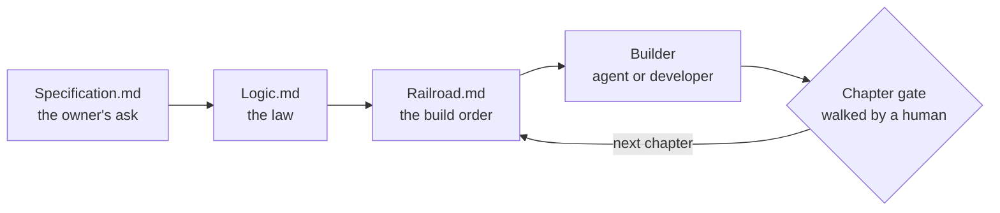

# Standard Template Construct (STC)

**A project-agnostic standard for how a software project is specified, sequenced and verified — so that whoever writes the code, a coding agent or a person, builds against written intent instead of guessing it.**

`Mk III Mod 1 A1` · [Logic](Logic%20Template.md) · [Railroad](Railroad%20Template.md) · [Specification](Specification%20Template.md) · [Methodology](supporting/Methodology.md)

---

## Why it exists

Most projects reinvent the same things, and reinvent them badly: where the specification lives, how the build is sequenced, what "done" means. With a coding agent in the loop the cost multiplies. An agent can satisfy every signature it is given and still write the wrong program, because "wrong" can only be judged against intent that somebody wrote down.

STC fixes **how** a project is specified, built and proven. It never decides **what** you build: a fifty-line utility and a hundred-module system use the same documents, and differ only in how much of them survives.

## The idea



Every decision is made upstream, in `Logic.md`, and frozen into signatures and pinned parameters. `Railroad.md` sequences the build into small steps whose bodies are close to mechanical, each with acceptance criteria written **before** the code. The Builder implements bodies and decides nothing; where a decision is missing, it stops and says so instead of improvising. Each chapter ends in a capability the owner can try by hand, and a human walks its checklist.

**Why "Railroad" and not "Roadmap".** A roadmap has junctions you may take differently on the day. Here the track is laid first, and the builder rides it without deciding where to turn.

## The six documents

Every project keeps them in its own `codex/` directory, beside the code they govern.

| Document | What it is | Written by |
|---|---|---|
| `Specification.md` | the owner's original ask, in plain language — frozen once the law opens | the owner |
| `Logic.md` | **the law**: what the system does and why, the file architecture, the frozen contracts | the Architect, with the owner |
| `Railroad.md` | the build order: steps, verbatim signatures, acceptance criteria | the Architect |
| `dependency.md` | everything outside the package manager — tools, runtimes, vendored sources, downloaded models | the Architect |
| `requirements.<ext>` | the pinned package manifest, installable as-is | the Architect |
| `DevLog.md` | the Builder's journal across sessions and machines | the Builder |

Four of them are law. The specification is an input and the Dev Log is a journal, and neither is ever allowed to drift into being law.

## What a project looks like

```text
<project>/
├─ config/            exactly four files: config, id_config, .env, .env.example
├─ <your packages>/   named after the work the program does
├─ logs/  misc/       the running program's own
├─ prompt_library/    only for projects that run on prompts they tune
├─ codex/             the six documents, plus ARCH/ for superseded versions
└─ construction/      the build's machinery: ledger, acceptance checklists, per-agent scratch space
```

Two entries in the root carry the process — `codex/` and `construction/` — and everything else belongs to the program.

## One standard, any size

A project starts by answering the **Project Profile**: thirteen yes/no questions — does it keep state between runs, talk to several external systems, run unattended, depend on prompts it tunes? Every answer defaults to **no**, and every no **deletes** sections from the templates. The same answers give the project a **Pattern** (I, II or III), which decides how much of the standard's apparatus runs at all. The rails, the shape of a step and the human-walked gates stay the same everywhere: a single-file script and a distributed platform ride the same railroad, and differ in how many cars it has.

## Verification, in one paragraph

Executable proof exists at exactly one altitude — the **chapter gate**. What gets proven is always the Architect's, written as criteria before any code exists; the Builder produces evidence, never criteria. A step closes on a printed checklist and writes nothing to disk to prove itself, and a chapter carries at most two verification files: the Architect's checklist and one evidence artifact. There is no per-step test suite, on purpose — [here is why](supporting/Methodology.md#where-testing-lives-and-why-it-is-not-where-you-expect).

## Quick start

1. **The owner writes `Specification.md`** from [the template](Specification%20Template.md) (or its [Polish twin](Specification%20Template%20PL.md)), then talks it through with the agent until satisfied.
2. **Create `codex/`** in the new project and copy into it the core templates and the ones in [`supporting/`](supporting/). The specification is frozen there the same day.
3. **Answer the Project Profile first**, compute the Pattern, and delete everything the answers point at — before writing anything else.
4. **Write `Logic.md` §2 and §3 first**: where each responsibility lives, and what each module does and why. Give §3 the most time.
5. **Freeze Appendix B and C** — the contracts and the config keys that let a builder work without guessing.
6. **Write `Railroad.md`**: build order from the dependency graph, chapters that each deliver something you can use by hand, Phase 0 in full detail. Then build.

The full procedure, including the checks to run before any code is generated, is in [supporting/Methodology.md](supporting/Methodology.md#using-this-template-for-a-new-project).

## What's in this repository

| Path | Contents |
|---|---|
| [`Logic Template.md`](Logic%20Template.md) | the law — what the system does and why |
| [`Railroad Template.md`](Railroad%20Template.md) | the build order — steps, signatures, acceptance criteria |
| [`Specification Template.md`](Specification%20Template.md), [`… PL.md`](Specification%20Template%20PL.md) | the owner's ask, in English or Polish |
| [`supporting/`](supporting/) | the DevLog, Dependency and Requirements templates |
| [`supporting/Methodology.md`](supporting/Methodology.md) | how STC works and why: scope, Patterns, verification, starting a project, and how the standard versions itself |
| `AGENTS.md`, `CLAUDE.md` | the contract for agents maintaining **this** repository — never copied into a project |

## Versioning

Versions read `Mk · Mod · A`. An **A** clarifies without changing any structure; a **Mod** changes a rule, a section or a Pattern; a **Mk** changes what a project produces or how it is proven. Every project's `Logic.md` declares the version it was built against — today that is `Built against STC Mk III Mod 1 A1` — and a change to the standard is never retroactive. Every bump is recorded in the commit that makes it — [details](supporting/Methodology.md#how-the-standard-versions-itself).

## License

© TemplarDragon. STC is licensed under [Creative Commons Attribution 4.0 International](LICENSE) (CC BY 4.0): you may use, adapt and share it, commercially too, as long as you give credit. Attribution can live where a project already names the standard — the `Built against STC …` line in its `Logic.md` — together with the author, a link to this repository and a link to the license.
