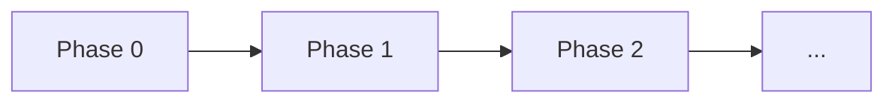

# `<PROJECT NAME>` — Build Railroad

> **[STC template — delete this callout before use.]** Companion to `Logic.md` (the "logic doc"). The logic doc is the *map of logic*; this file is the *build order*. **This railroad adds no new logic.** If a build step appears to require a logic decision, that is a defect in the interface freeze — not a licence to decide (§0 rail 4). `<ANGLE_BRACKET>` placeholders and `[STC: ...]` instruction lines are yours to fill in / delete.
>
> **Status:** `<PLANNING | PHASE N IN PROGRESS | COMPLETE>`.

---

## 0. How to use this railroad — builder contract (READ FIRST)

[STC: this whole §0 is pure process, no domain content. Keep it almost as-is; it is the actual payload of the STC standard.]

**Roles.** Code is generated by a **Builder** (a coding agent, or a developer) riding these rails. The rails — this file plus the **frozen acceptance criteria** — are authored by an **Architect** (a lead/senior role, human or AI) with the project owner. The logic doc is **read-only law**: the Builder may read it, never edit it, never contradict it.

**Guiding principle:** *the railroad converts every open decision into a closed instruction + an observable outcome.* Steps say **"implement to satisfy X"**, never **"design / decide X"**. Every design decision already exists in the logic doc; the railroad's job is to remove all remaining choices.

**Verification altitude — read this before you generate anything. This block is the rule; every prohibition elsewhere in this file is derived from it and none of them stands on its own.** Executable verification in STC obeys three clauses:

1. **Altitude.** Executable observation exists at exactly **one** altitude — the **chapter gate**. A step closes on a *printed* ✓/✗ checklist, a few lines of output, and writes nothing to disk for verification purposes.
2. **Authorship.** *What* is proven is always the Architect's, written as a `V#` before any code exists (rail 2). A Builder may produce an observation; it may never author a criterion.
3. **Cap.** Two files per chapter and no others — the Architect's Acceptance Checklist and the Builder's evidence artifact (Appendix R3).

A "chapter" is one phase below (§4 onward) = one row of the milestone ladder (§2) = a **user-testable MVP increment**, and its gate is walked by a **human** against a checklist written in the owner's terms, never in the code's.

**What the three clauses rule out.** At step level: a test file, fixture, harness, mock, test config, testing dependency, regression pass, or a "quick script to check this" that survives the step — every one of those fails clause 1. At any altitude: a check whose criterion the Builder chose fails clause 2, however good the check is. And a second checklist or a second evidence file inside one chapter fails clause 3. Read those as consequences, because that is what they are: the question to ask of a proposed artifact is *which clause does this satisfy or break*, not *does it resemble something on a banned list*.

**The vocabulary trap, stated out loud so nobody has to reconcile it alone.** The chapter evidence artifact (R3.3) **is** an executable file. It boots the system, reaches through pinned observation seams, provokes races, prints a `PASS`/`FAIL` line, and may legitimately pull a testing dependency (through Step 0.0's freeze, invariant 2) and a runner config (§0.5). It is permitted because of **where it sits** and **whose criteria it serves** — not because it manages to avoid looking like a test. The same file written at step level, or written against a criterion the Builder invented, is forbidden. **Judge an artifact by altitude and authorship, never by its filename or its imports.** This is worth a paragraph because Mk I phrased the prohibition as a standalone taboo, left a need rail 6 genuinely creates with nowhere to go, and the project riding it grew per-step evidence files anyway — a rule stated as a taboo gets obeyed in letter and routed around in fact.

**Scope of the standard — what STC does and does not decide.** STC fixes **how** a project is specified, sequenced, built and verified: the four documents, the interface freeze, the step template, the rails, the verification altitude. It does **not** decide what kind of system you are building. Whether this project has adapters, a database, background workers, runtime modes or plugins is answered once, in `Logic.md` §0.1 (**Project Profile**), and every `[PROFILE Pn]` marker in this file and in the logic doc inherits that answer.

**The Pattern decides how much of this file's apparatus runs.** `Logic.md` §0.1 computes the project's **Pattern** (I, II or III) from the profile and **owns that rule** — this file never restates the formula. What it owns instead is the catalogue below: the build-side apparatus, **numbered**, so that a `PATTERN-EXCESS` ("one structure from the class above") counts something enumerable rather than something arguable.

| # | Apparatus | Pattern I | Pattern II | Pattern III |
|---|---|---|---|---|
| **A1** | contract appendices (`Logic` B, C) as standalone appendices rather than inline in the sections that use them | inline permitted | separate | separate |
| **A2** | **Appendix R8** — the Architect-side audit protocol | absent | optional, once at the freeze | at the freeze and at every Mod bump |
| **A3** | per-chapter **evidence artifact** (§0.3, R3.3) — ONE executable file carrying three jobs: happy-path tripwire, mechanism observation, invisible-property probe | absent | the owner's call | mandatory |
| **A4** | *retired in Mk II — folded into A3.* The number is **kept and never reused**: `PATTERN-EXCESS` counts against these numbers, so renaming or recycling one silently invalidates every count already recorded against it | — | — | — |

**Nothing else in this file is class-dependent.** In particular: the rails, the step template, the stub protocol, human-walked chapter verification, the reading order, the number of chapters (that is a function of capabilities, never of class), and the availability of the LONG CHAPTER protocol (gated by its own declaration rule — *no intermediate state of this is observable* — which bites harder than any class would). A deliberate departure from the table above is a `PATTERN-WAIVER` or `PATTERN-EXCESS` recorded in `Logic.md` §14 — never a quiet decision taken inside a step. **A structure whose profile row is NO does not exist in this project** — not as an empty folder, not as a stub, not as an abstraction "for later". Deleting it is the standard working correctly. A single-file script and a distributed platform ride the same railroad; they differ in how many cars it has.

**This file is expected to get large, and that is not a problem.** A complex system earns hundreds of steps across a dozen chapters; a small tool earns twenty across three. What never changes is the **size of a step** (rail 5) — more work means *more* steps, never bigger ones. Size stays harmless because of the reading order below: the Builder loads one step block plus the appendices it names, never the whole file. A three-hundred-step railroad therefore costs exactly what a twenty-step one costs, per step. Size is a navigation problem, and the numbering is the navigation.

**Reading order — what the Builder loads before a step N.M (do NOT load the whole file):**
1. **Once per session:** §0 (this contract) + §0.5 (the file tree).
2. **The step N.M block itself** — its `Frozen surface`, `Logic decisions D#`, `Contract`, `Verify`, `MUST NOT`.
3. **From the logic doc:** ONLY the `B.8.x` subsection(s) the step's `Freeze refs` name (+ the `§§` it cites) — not the whole logic doc.
4. **The appendices the step points to:** `R1` (data shapes), `R2` (its stubs), `R3` (verification rules), `R6` (variable homes).
5. **Once per session, the tail of `codex/DevLog.md`** — the latest handoff block and the open queue, **not the file**. That is where the previous session (possibly on another machine) recorded what state the tree is in and what the next action was. It is a **journal, not law**: it can tell you where things stand, and it can never tell you what to build or authorise a decision the freeze does not make.
6. **Nothing else.** If the step seems to need more than this, that is a `CONTRACT-GAP` → HALT (do not go hunting for a decision). **Appendices R7 and R8 are Architect-side and are never loaded by a Builder** — R8 in particular is the protocol for auditing the freeze, and a Builder reading it would start negotiating with the law it is supposed to ride. **`Specification.md` is never loaded either**: it is the owner's original ask, frozen in `ARCH/`, and it was superseded by the logic doc on the day that document opened.

> **Sanctioned reference lookup — AI/LLM projects only (does not widen the reading order above).** On projects involving AI/LLM work, the Builder **may** consult the curated **skill base** for *technique and idiom* lookups — how a pattern is normally implemented, what a library's shape is, what a known pitfall looks like, what a working version of this looks like in a real system.
>
> - **Availability, checked once per session, not mid-step.** Preferred entry point is the user-scoped **`skill-base` skill** (reachable from any project). Failing that, the vault at `G:\Mój dysk\DEV DEPARTMENT GD\AI-LLM\ObsiClaude` — skill missing but vault present means this machine was never bootstrapped (`bootstrap/install-skill-base.ps1`; propose, don't run unasked). **If neither resolves, ask the user whether they have access to it and where it lives** — do not assume it is gone (spaces and a non-ASCII character in the path, drive letter varies per machine), and do not treat its absence as a blocker: it is an accelerator, never a prerequisite. A step that *cannot be completed without it* is not a missing repository — it is a `CONTRACT-GAP`.
> - **Graph-first, both layers, never bulk-loaded.** *Why/pitfalls* → grep the theory index `REPOS/AID4-SKILL/knowledge-graph/graph.json` by concept id, then open only the files it names. *How/working code* → `graphify query|explain|path --graph ~/.graphify/global-graph.json`, a local traversal at zero model cost; open only the `source_file:line` it returns. Note the confidence tag (`EXTRACTED` vs `INFERRED`), and cite file paths and symbols — never a community/subsystem name, which shifts between graph rebuilds. **Do not rebuild a graph during a build step**; that is vault maintenance (5–9 minutes) and has nothing to do with this project.
> - **Never use it to answer questions about *this* project's code.** It answers "how has this kind of thing been solved before", not "what does this repo do". For this repo, the step block and the freeze are the only sources.
> - **Its hard boundary is rail 4, unchanged:** what the base contains is *reference, never law*. It can tell you how something is usually done; it can **never** supply a decision the freeze failed to make, and finding a nicer approach there is **not** grounds to deviate from the frozen contract — that is still a `CONTRACT-GAP`, raised and amended like any other. Where base and freeze disagree, the freeze wins. Copying a reference implementation's *architecture* is out of scope entirely — mine techniques, build against Appendix B.
> - **Cite it in the step's completion note** when an implementation choice came from the base ("following `…/src/shared/result.ts`"), so the Architect can audit it against the freeze. Vendoring third-party code is a licensing decision and a `dependency.md` / `requirements.<ext>` change — i.e. not something a step may do on its own.
>
> (Full usage guide, corpora registry, and operating notes: the project's `README.md`.)

### 0.1 The seven rails (redundant on purpose)

1. **Frozen public surface.** Each step quotes the exact signatures/types it must expose, copied **verbatim** from the Interface Freeze (logic doc Appendix B). The Builder implements **bodies only**. It MUST NOT invent, rename, widen, or re-type any identifier.
2. **Frozen acceptance criteria — written, not generated.** Each step ships with a `Verify:` block written **before** the code: for every frozen decision, the **observable outcome** that proves it holds, phrased so the project owner can check it by hand. The step is done **iff every `D#` is demonstrably satisfied and every `V#` observed**, reported as a printed checklist. The Builder MUST NOT reword, weaken, or "interpret" a criterion to make it pass. **Authorship (closes the circularity, and this rail owns clause 2 of §0):** criteria are the Architect's, in this file; the Builder produces *evidence*, never criteria. **Cost boundary (this rail's whole point):** the criteria are prose, so they cost tokens once at authoring time and nothing thereafter — which is what makes §0's altitude clause affordable rather than merely austere. A per-step suite would be a fourth redundant copy of rails 1/3/6, paid for in generated files, repeated full-suite runs, and repair loops; and a check the owner cannot read is not verification, it is a second unreviewed artifact.
3. **MUST-NOT list.** Each step enumerates forbidden actions (new state fields, new config keys, control-flow changes, new dependencies, editing the logic doc, touching another step's files).
4. **HALT-on-gap.** If the Builder believes the logic is wrong, a contract is missing, or an acceptance criterion is unsatisfiable without a design choice → it **STOPS** and emits `CONTRACT-GAP: <precise description>`. It does **not** improvise. Resolution is a freeze amendment by the Architect; then the step resumes.
   - **Sub-type `CONTRACT-GAP: ACCEPTANCE-DEFECT`** (a *mechanically* impossible acceptance criterion — it names a symbol absent from B.8, an unreachable state, or an outcome the frozen surface cannot produce): may be raised **only after the code demonstrably satisfies every D#** yet the criterion still cannot be observed, and **must carry the observed-vs-expected evidence** — *difficulty is never a defect*. The Builder **still never rewrites the criterion**; it may *propose* a corrected one, which the Architect refreezes. **Anti-thrashing bound:** do not exceed **3** code revisions chasing a criterion your D# checklist says already holds — HALT with `ACCEPTANCE-DEFECT` instead. **Writing a test to "prove" the criterion is wrong is not an allowed move** — it is the artifact this standard exists to prevent; produce the trace or the observed output instead.
     - **The cheapest trigger for this sub-type, and the one Builders miss (Mk II):** *did observing this `V#` require me to bring into existence a structure that is absent from Appendix B?* If yes, stop — that is an `ACCEPTANCE-DEFECT`, not an implementation detail. The criterion is asking for a precondition the product cannot reach, and supplying it locally makes the gap invisible until integration (rail 7). *Worked case:* a criterion demanded a shielded side effect and its delivery-log rows at a step that had no tool layer, no such log and no shielded section anywhere; the only way to green it was a private registry in no appendix plus a fabricated task, so the criterion was satisfied by scaffolding rather than by the product. The right move was to raise the defect and propose moving that half of the criterion to the step where both halves exist.
   - **Sub-type `CONTRACT-GAP: ATTENDED-UNAVAILABLE`** (for steps that need a human present): if no one responds within the agreed window, emit it, then **skip forward ONLY to steps that do not depend on the attended one** (Appendix R4's dependency edges are binding). Resume later; never mark it done, never substitute a shortcut.
5. **Small steps.** Each step is sized so that, given the frozen surface + the `D#` list + the `Verify:` block, the body is close to mechanical. With per-step suites gone, this rail carries more weight than before: a step small enough to be mechanical is also small enough that a printed checklist is honest proof of it.
6. **Frozen parameters (closes the "mechanical" loophole).** A signature can be frozen while the **decision inside the body** is not. If a step's body needs a **threshold, formula, ordering rule or overflow behaviour**, that value MUST be pinned — either as a typed key in Appendix C or as an explicit formula in a `D#`. A bare adjective — "reasonable", "low-value", "balanced" — is **not a specification, it is a `CONTRACT-GAP`.** Corollary for acceptance criteria: a `V#` must pin the **mechanism**, not only the qualitative outcome ("the interval never decreases" cannot distinguish linear from exponential backoff — name the multiplier *and* the cap, and say what the operator should see). This rail is what makes cheap verification safe: an exactly-pinned parameter is checkable by reading one printed value, so it needs no test to defend it.
   - **Second corollary — negative-edge coverage (Mk II).** Where a `D#` pins a **state machine, a transition set or an ordering**, at least one `V#` must assert a transition the law does **not** have. A criterion that only walks the path the law describes cannot tell a correct implementation apart from one carrying an **extra** edge, so it passes on both. *Worked case:* a circuit breaker's criterion walked `CLOSED → OPEN → HALF_OPEN → CLOSED` on the pinned counts and read green for weeks, while a successful probe arriving **during** the cooldown closed the breaker outright — skipping the timeout and the whole half-open probation, an edge the decision never granted. The criterion never saw it because it advanced the clock past the cooldown before its first success, so the illegal state was never the state under test. Writing "and one success **inside** the cooldown leaves it OPEN" costs one line and is the difference between a criterion that describes the law and one that defends it.

7. **Provisioned & reachable surface (closes the "frozen but unbuildable" loophole).** Rail 1 freezes *names*; rail 6 pins *values*; neither of them makes a thing **reachable**. Every structure a step touches must additionally have a **source** — a config key, an owning step, an operator command, a component that populates it — and a **path from the state the caller actually holds**. The three properties fail independently, and the missing-source and missing-path failures are the ones that survive every paper review, because the prose reads complete: a config key nothing reads, a singleton no step fills, a rule that reads a state field absent from B.2, a rule that must act on every in-flight unit of work when the only handle lives inside one of them.
   - **The Builder's obligation:** if a step's `D#` needs a value nothing provides or a field that does not exist, that is a `CONTRACT-GAP` — **not** an invitation to supply the value in the step. Injecting it locally is what makes the gap invisible until integration, and it is the one shortcut that reliably converts a documentation defect into a production one.
   - **The Architect's obligation:** a step that *reads* a singleton, registry or config-fed structure **names the step that populates it**, and that step comes earlier. See invariant 11 and Appendix R8.

### 0.2 Stub protocol

**A stub stands in for something *this* baseline builds later — nothing else.** If no step in this railroad ever fills it, it is not a stub: it is either a `CONTRACT-GAP` (a load-bearing symbol with no owning step) or a **deferred** item, and deferred items have **no stub, no file, no directory and no registry entry** — they are absent from the tree entirely (`Logic.md` §2.1 rule 5, §13). An empty module sitting where a component belongs reads as unfinished work, and unfinished work gets finished by whoever passes next.

Any not-yet-built **runtime** dependency is represented by a **stub** that:
- honours the frozen signature exactly;
- returns a **typed canned value** (or raises a declared, typed error);
- logs `STUB:<qualified_name>` on every call;
- is registered in `construction/ledger/stub_registry.md` (checklist: name · honoured signature · replacing step).

A milestone may be **green with stubs present**, but every green milestone **enumerates exactly which stubs remain**. Replacing a stub MUST NOT change any signature → no upstream backtracking.

### 0.3 Definition of "done" — two altitudes, and only one of them costs anything

**Per step — a printed checklist, zero artifacts.**

- every `D#` demonstrably satisfied · every `V#` observed · the project still builds and boots · zero new identifiers · zero open `CONTRACT-GAP` · stub registry updated · **the Dev Log's handoff block current** (what state the tree is in, what the next action is — written for a session that may resume on another machine and cannot ask you anything).
- **One question, asked out loud, before the checklist is called done (Mk II):** *did observing any `V#` require a structure absent from Appendix B?* A private registry, an injected task, a flag added to make something visible — if the answer is yes for even one criterion, the step does **not** close. That is an `ACCEPTANCE-DEFECT` (rail 4), and the reason it needs asking explicitly is that supplying the missing structure feels like implementation work rather than like the contract violation it is.
- **Forcing function:** at step close, emit this checklist explicitly (each item ✓/✗ + a one-line proof — the value printed, the log line seen, the command's exit code). The step is not "done" until that record is printed. *That record is the deliverable of verification at this altitude — nothing else is produced.*
- **MUST NOT at step level — all of it §0 clause 1, none of it a separate rule:** create a test file, fixture, harness, mock, or test config · add a testing dependency · run a full regression pass · write a "quick script to check this" that survives the step. Each fails for the same single reason — executable observation lives at the chapter gate, and this is not it. If you believe the step cannot be proven without one, that is a `CONTRACT-GAP` about the `V#`, not a licence to generate one.

**Per chapter — the real gate, walked by a human.**

A chapter (= one phase, = one milestone-ladder row) is a **user-testable MVP increment**. Its gate is:

- the chapter's **Acceptance Checklist** (Appendix R3) walked **by the project owner or a human tester** — each line an action plus the expected observation, in the owner's language, not in the code's;
- **every prior chapter's checklist re-walked** — this is where regression is caught, not at step close;
- remaining stubs enumerated · the chapter's semantics in logic §7 satisfied;
- **`construction/<XX>_workspace/` emptied** (`Logic.md` §2.4). Anything in it that turned out to matter is first promoted into the tree by a step that owns it; whatever remains is deleted unread. A chapter does not close over a full scratch bin — that is how a throwaway probe quietly becomes load-bearing.
- **The chapter evidence artifact — ONE file, three jobs, written at the chapter's last step** (apparatus A3; R3.3 has the full contract). Mk I split this in two — an optional happy-path smoke script and, at Pattern III, a separate probe — and the split cost a second write event without buying a second kind of proof. It is one file now, and it does three things a human walk cannot: it **re-walks the happy path** of accepted chapters as a tripwire so the manual regression does not grow without bound; it **observes the mechanisms rail 6 pinned** — a bucket depth, a refill interval, an ordered effect trace, a gate that must not have been consulted — none of which a person can see by driving the system by hand; and it **provokes the invisible properties** of this chapter — a race, a lost write under two writers, a duplicated effect after a restart, a loop alive but starved. **Absent at Pattern I · the owner's call at Pattern II · mandatory at Pattern III.**
  - **Authorship, and why rail 2 survives it.** The file is written by the **Builder**, at the chapter's last step, and **every observation in it must trace to a `V#` the Architect already wrote.** That is what keeps it evidence rather than criteria: the Builder chooses nothing about what is proven, only how the already-frozen observation is produced. A provocation with no `V#` behind it is the Builder inventing a criterion — forbidden by rail 2, and the reason Mk I insisted the probe was Architect-authored. Naming the constraint this way keeps that guarantee while moving the typing.
  - **Written at the END of the chapter, against settled code — never step by step.** Per-step evidence files were measured on a real project and were **1.36× the size of the product code they observed**, with the same scaffolding written six times; the cost was not the running (a full re-walk of 41 criteria prints six lines) but the **re-cutting**, because an amendment mid-chapter moves the product under every file already written. One file at the end has one write event and nothing to re-cut.

**When a chapter genuinely cannot be small — the LONG CHAPTER protocol.**

The ladder rule (§2: one visible capability per chapter) splits most work. Sometimes it cannot: the capability is **atomic** — a handshake that only functions complete, a migration that is all-or-nothing, a format that is only valid whole, a rewrite with no runnable intermediate. Forcing such work into small chapters produces chapters that demonstrate nothing, which is worse than one honest big one.

So the railroad has one siding, and it is narrow:

1. **Declare it.** The chapter header carries `LONG CHAPTER — <why it cannot be split>`. **"It is a lot of work" is not a reason; "no intermediate state of this is observable" is.** If you cannot write the second kind of sentence, the chapter was splittable.
2. **Segment the checklist into numbered checkpoints** `C1..Cn`, each anchored to the last step that makes it observable. A checkpoint is a real acceptance walk — action → expected observation — just a partial one.
3. **Walk each checkpoint when it is reached**, not all at the end. That is the entire point: it converts one unwalkable sitting into several short ones, without pretending the capability shipped earlier than it did.
4. **Record a passed checkpoint** (date + who walked it) in `construction/ledger/`. It is not re-walked later in the same chapter.
5. **The chapter gate** = every checkpoint recorded **+ one short end-to-end pass** of the whole capability. The end-to-end pass is not optional: checkpoints prove the parts, and parts passing is not the same claim.
6. **Regression scope stays bounded:** later chapters re-walk a LONG chapter's **final end-to-end segment only**, never its checkpoints. Without this rule the regression walk grows without limit and the whole budget argument collapses.
7. **Hard cap — more than five checkpoints means it was splittable.** Go back to the ladder rather than declaring a longer siding. A chapter needing many checkpoints is a chapter delivering many capabilities, which is the definition of splittable.

A LONG chapter is a **declared exception with a written reason**, not a fallback for planning that ran out of time. Two of them in a row is a signal the ladder was drawn wrong.

**Why this is not laxness.** The anti-improvisation guarantee comes from rails 1, 3, 4 and 6 — a verbatim-copied frozen signature, an explicit MUST-NOT list, HALT-on-gap, and pinned parameters. A per-step test suite restated the same constraint a fourth time, and paid for it in generated files, quadratic re-runs, and repair loops. The one thing it bought that a checklist does not is **cross-chapter regression detection** — which is precisely why the chapter gate re-walks prior checklists and why the capped evidence artifact exists. Trade named openly: between two chapter gates, a silent regression can live undetected. That window is the price of the token budget, and it is bounded by the chapter, not by the project.

**Adopting a real automated suite later is a legitimate, separate decision** — made by the owner once there is a working proof of concept worth protecting, planned as its own chapter with its own steps. It is never something the Builder starts on its own initiative mid-build.

### 0.4 Step template (every detailed step uses this **expanded** shape)

The template is deliberately verbose: it leaves **no interpretation room**.

```text
Step N.M — <title>
Depends on:      <prior steps that must be green + Appendix B/R refs>
Goal:            <one sentence>
Logic refs:      <§§ of the logic doc — the law for this step>
Logic decisions implemented (verbatim; the code MUST satisfy each — do NOT re-derive):
                 - D1: <exact restatement of a § decision as an assertion>
                 - D2: ...
Freeze refs:     <Appendix B.* identifiers + Railroad R1 data shapes used>
Creates:         <file → the exact symbols (funcs/classes) it defines>
Populates:       <the singletons / registries / config-fed structures this step FILLS (B.6, App-C) — the
                 counterpart of "Creates" for state rather than code; write "none" and mean it>
Reads populated: <every singleton/registry/config structure this step CONSUMES → the step that populated it,
                 which MUST be an earlier step. An unfillable name here is a CONTRACT-GAP, not a to-do (rail 7)>
Frozen surface:  <signatures copied VERBATIM from Appendix B.8 — implement bodies only>
Contract (per fn): <preconditions · postconditions · raises (typed errors)>
Data shapes:     <→ Appendix R1 entities/payloads this step reads/writes>
Implement:       <behaviour; every claim traceable to a Logic ref or a D#>
MUST NOT:        <forbidden actions — new identifiers, control-flow changes, banned libs, …>
                 + ALWAYS (§0 clause 1 — one altitude): no test file / fixture / harness / mock, no testing
                 dependency, no regression pass
Stubs (this step): <→ Appendix R2 catalog entries standing in here>
Verify (Architect-authored, immutable; observable evidence — NOT test code):
                 - V1: <what to run or call> -> <the exact observable result proving D1: value / log line /
                       exit code / file written>
                 - V2: ...
Definition of done: every D# demonstrably satisfied · every V# observed · project still builds and boots ·
                 zero new identifiers · stub registry updated · zero open CONTRACT-GAP · Dev Log entry +
                 handoff block written · NO V# was observed by creating a structure absent from Appendix B
                 (§0.1 rail 4 — if one was, the step does not close). Emit the ✓/✗ checklist with a one-line
                 proof each (§0.3) — that printout IS the artifact; the Dev Log entry is a note and never
                 stands in for it.
On gap:          HALT + emit "CONTRACT-GAP: <precise description>" (ACCEPTANCE-DEFECT sub-type only WITH
                 observed-vs-expected evidence, §0.1 rail 4); do not improvise, do not reword the criterion,
                 do not write a test to argue with it.
```

> **Reading rule:** implement **exactly** the `Frozen surface` bodies so that **every** `Logic decision D#` holds and **every** `V#` is observable as written. If any D# and any V# appear to conflict, or a V# needs a value/shape not pinned in R1, that is a **CONTRACT-GAP** — HALT, do not choose.
>
> **Sizing rule for `Verify:`** — 1–4 `V#` per step, one per `D#` that has an externally visible effect. A decision with no observable effect at this step does not get a `V#`; it gets verified at the chapter gate, in context, where it finally shows. Do not manufacture observability (extra logging, debug flags, exposed internals) just to give a `D#` a `V#` — that is a control-flow change and a MUST-NOT.
>
> **Where a `D#` pins a transition set, one of its `V#` asserts an edge the law does not have** (rail 6, second corollary). This does not raise the 1–4 budget: it is a clause inside an existing `V#`, not a fifth one.

---

### 0.5 Full project file tree — scaffold-first (READ EARLY)

**Scaffold-first build.** The **entire tree below is created first** — every file and directory exists from day one as a **stub** that honours its frozen signature (Appendix R2). The system therefore **boots and runs (its most minimal mode) with the whole tree present but hollow**. Each later phase only **fills** the relevant stubs — it **never adds or moves files** (the tree is fixed at scaffold time).

- **What each file DOES** → the annotation on its line below.
- **HOW each file is constructed** → *initially* its stub (R2), *finally* the Frozen surface (verbatim B.8 signatures) of the step that owns it (the `(Step x.y)` tag).
- **This is the BUILT PROJECT's tree** — it is NOT the design workspace these four documents live in. The design workspace (this file's own directory) holds only `Logic.md` / `Railroad.md` / `dependency.md` / `requirements.<ext>` and, optionally, an `ARCH/` archive of superseded logic-doc versions; it is not part of what gets deployed, and may not even be the same repository.

**The authoritative file architecture is `Logic.md` §2.1 — not this section.** The tree there is a design decision with a stated why; what follows is the same tree seen from the build side, annotated with stub and ownership rules. **If the two ever disagree, `Logic.md` wins and the difference is a `CONTRACT-GAP`.** The skeleton below is the shape STC expects a filled-in §2.1 to have; it is assembled from the Project Profile (`Logic.md` §0.1), never copied wholesale. A directory that exists "for later" is a lie the scaffold step will faithfully build, and every stub in it becomes something a Builder must carry, register, and explain.

**BASELINE — every project, regardless of size or kind:**

```text
<project root>/                  # = the BUILT PROJECT, on the target machine/repo; this doc workspace is DESIGN-ONLY
├─ <entrypoint>                  # ROOT EXECUTABLE — running it starts/does the thing (§2.2 of Logic.md)
│                                #   more than one only if §2 names more than one; each needs its own reason
├─ config/                       # the ONE config surface
│   ├─ enums.*                   # B.1 enums — single home
│   ├─ types.*                   # B.8.0 DTOs / shared types
│   ├─ config.*                  # config model + load_config() (B.8.1); validates Appendix-C keys, fail-fast
│   └─ *.<ext>                   # operator-owned data files (policies, presets, lookup tables)
│
├─ <domain>/                     # WHAT THIS PROJECT ACTUALLY DOES — one package per coherent responsibility.
│                                #   Name them after the work (parsing/, pricing/, sync/), never after a layer
│                                #   pattern. For a small tool this may be a single package, or a few modules.
│
├─ <commands>/                   # the operator-facing verbs, one module per command  [merge into <domain>/ if few]
├─ <utils>/                      # DEPENDENCY-FREE leaf utilities: imported by everything, imports nothing local
│
├─ <artifacts>/                  # whatever this program reads/writes: CSV/, out/, reports/ — omit if it writes none
├─ logs/                         # runtime logs — [gitignored]
├─ misc/                         # the PRODUCT's own miscellany — belongs to the program, not to the build
│
├─ codex/                        # operator documentation  [optional], plus:
│   └─ DevLog.md                 # the BUILDER's append-only journal — never law, never a decision.
│                                #   Lives with the code so it survives a change of machine (§0 reading order)
└─ construction/                 # EVERYTHING that exists only because of the build process (Logic.md §2.4).
    │                            #   With codex/ these are the root's only two process entries; every
    │                            #   directory above them belongs to the program being built.
    ├─ ledger/                   # the build's OWN bookkeeping, never documentation: stub_registry.md +
    │                            #   gate records. Committed — it is how a later session, on another
    │                            #   machine or with a different agent, knows what is still a stub and
    │                            #   which gates were signed. It belongs to the project, never to one agent
    ├─ acceptance/               # CHAPTER-grained verification. Max 2 files per chapter, and no more, ever
    │   ├─ CHAPTER_<n>_ACCEPTANCE.md  # human-run checklist: action -> expected observation. ARCHITECT-authored,
    │   │                             #   created by the chapter's FIRST step, read-only for the Builder (R3.2)
    │   └─ evidence_chapter_<n>.*     # the chapter's ONE executable artifact — tripwire + mechanism observation
    │                                 #   + provocation. BUILDER-authored at the chapter's LAST step; every
    │                                 #   observation traces to an Architect-written V#. Absent at Pattern I,
    │                                 #   owner's call at II, mandatory at III (apparatus A3, R3.3)
    └─ <XX>_workspace/           # THE ONLY throwaway directory — ONE PER AGENT (CC_workspace/, CX_workspace/,
                                 #   …) so two agents never share a scratch area. Spikes, probes, one-off
                                 #   scripts, sample data, temp output. Gitignored. EMPTIED at every chapter
                                 #   gate. Product code NEVER imports from it. No other throwaway directory
                                 #   exists anywhere in this tree.
```

That baseline is a **complete, valid STC tree**. A single-purpose CLI tool or batch script stops here — entry point, config, the work, its utilities, its data files, logs. If that is your project, the block below is not a to-do list; it is a set of things you are correctly not building.

**PROFILE BLOCKS — append a block ONLY if its `Logic.md` §0.1 row is YES:**

```text
[P1b — two or more external surfaces]
├─ <interface_layer>/            # adapters — one package per external surface, NO business logic (§4.3)
│   ├─ base.*                    # adapter protocol + manifest types (B.8.3, §4.1)
│   ├─ registry.*                # loaded adapters + manifests (B.6)
│   └─ <loopback_or_local>/      # in-memory adapter + inject() entry — FIRST adapter to build; PRODUCT code,
│                                #   not test code: it lets a human drive any chapter with no network/tokens

[P2 — state outlives a run]
├─ <data_layer>/                 # persistence facade + entities (every write via one writer, if that applies)
│   ├─ facade.*                  # persist_*/read_*/write_* (B.8.6)
│   ├─ writer.*                  # the single serialized writer, if applicable (§5.1)
│   └─ schema.*                  # R1.1 schema/DDL, applied on init   [omit if the store is plain files]
├─ storage/                      # DATA ONLY (no code) — [gitignored]

[P6a — concurrent / staged processing]       [P8 — interchangeable backends]
├─ <core_subsystems>/            # the pipeline's internals            ├─ routing.*   # provider selection (§10.3)
│   ├─ graph.*                   # stage topology + checkpoints (§8.5)  └─ backends/  # base protocol + one per provider
│   └─ nodes/                    # one module per stage

[P9 — third-party/operator extensions]       [P5a/P5b — named modes]        [P7 — unattended operation]
├─ <extensions>/                                └─ config/boot.*             └─ <entrypoint_2>
│   ├─ registry.*   # register_*, get_*, spec       # detect_mode(),             # supervisor / restart / recovery
│   ├─ executor.*   # run_* + execution log         # select_preset() (§10.4)     # executable (§9.1/§9.2)
│   └─ adapters/    # one per extension
```

> [STC: `<domain>`, `<commands>`, `<utils>`, `<artifacts>` and every `<bracketed>` package above are placeholder names — replace them with names drawn from **your** problem domain. Keep the *roles* distinct rather than the *names*: the work, the operator verbs, the dependency-free leaf, the data. A small project legitimately collapses several into one package; don't invent a package that has nothing to own. **The reverse error is the expensive one:** a `<core_subsystems>/` with a single stage in it, or a `<data_layer>/` facade over one CSV file, is indirection that every future step must route through for no benefit.]

> **What counts as "the §0.5 set" for scaffold conformance:** the paths enumerated above, plus `__init__`/index files created by rule at scaffold time, plus root tooling config (`.gitignore`; a test-runner config **only if** a chapter evidence artifact actually needs one). **Excluded from any ownership walk:** VCS metadata, build caches, the *contents* of `storage/**` and `logs/**` (the directories must exist; what accumulates inside is runtime data, gitignored), and the *contents* of `construction/<XX>_workspace/` (disposable by definition — see `Logic.md` §2.4).
>
> **Note the absence of a `tests/` tree — it is deliberate, and it follows from §0's cap rather than from a dislike of the directory.** Verification is chapter-grained: `construction/acceptance/` gains **one checklist per chapter**, written by the Architect at chapter-authoring time, and **one evidence artifact per chapter** beside it, written by the Builder at the chapter's last step (R3.3). Two files per chapter is the whole budget, so there is nothing for a `tests/` tree to hold. Hence also: no per-step test file, no per-step evidence file, no shared fixtures module, no mock library — each of those is either a third file in a chapter (clause 3) or an executable check below the gate (clause 1).

---

## 1. Dependency plan — the two graphs

The backtracking risk ("an upper component didn't know something would be needed/returned later") is a **definition** problem. It is solved by **freezing the interface first**, *not* by build order. Once definitions are frozen, build order is free to optimise for early testable milestones.

### 1.1 Definition graph — FREEZE THIS FIRST (leaves → up)

Freeze in this order; each layer only references the ones already frozen:

1. **Enums** — Appendix B.1 (no dependencies).
2. **Config keys** — Appendix C (reference enums).
3. **[P1] Interface-layer payloads** — Appendix B.3 (reference enums).
4. **[P2] Primary-store entities + fields** — Appendix B.4.
5. **[P3] Second-store elements** — Appendix B.5.
6. **Runtime state** — Appendix B.2 (references payloads + enums).
7. **Singletons + special lifecycles** — Appendix B.6, B.7 (skip either if the program has none).
8. **Module public surface** — the per-module function signatures each boundary exposes — Appendix B.8. **This is the biggest anti-backtracking lever**; the Builder copies those signatures verbatim (§0 rail 1).

> Freeze completeness is validated by walking the **hardest** paths, not the easiest ones — easy paths never exercise the fields your most complex feature needs.

### 1.2 Runtime graph — BUILD / STUB ORDER

Logic Appendix A gives the runtime dependency chain. The build order **inverts it opportunistically with stubs** to reach demonstrable chapters early:

- `<Chapter 0>` needs only `<config → entry point → the thinnest path that runs>` — everything else stubbed.
- `<Chapter 1>` adds `<the first real unit of work, on real input>`.
- `<Chapter N>` adds `<one more capability the owner can see>`; the heaviest and least reversible work goes last, not first.

[STC: state the *actual* chain for your project in these terms. The pattern that matters: a chapter never waits for a component below it to be real — it stubs it. What it must never do is wait for a component *above* it, which is what the interface freeze makes impossible.]

### 1.3 Why build order ≠ dependency order

The entry point sits near the **top** of the runtime graph yet is built **first**, against frozen contracts, with everything below it stubbed. Because signatures are frozen, replacing a stub never forces an upstream edit → the sequential "top-to-bottom" build never has to backtrack.

---

## 2. Chapter ladder — one row = one chapter = one MVP

[STC: each row = a functional subset **the owner can exercise by hand**. **[P5]** If the project has named operational modes, anchor the rows to them; otherwise anchor them to capabilities, which is the normal case. This is the load-bearing table of the whole verification model (§0.3): if a row cannot be demonstrated to a human in a few minutes, it is not a chapter — split it or move work between rows until it is. The last column becomes that chapter's Acceptance Checklist (Appendix R3), so write it in the owner's terms, not the code's.]

**The shape of the ladder — one rule, then examples.** Chapter 0 is *the thinnest path that runs end to end*; every later chapter adds **one** capability the owner can see. Nothing else is prescribed: the row labels below are illustrations of that rule for different kinds of project, not a sequence to reproduce.

**No Pattern prescribes a number of chapters.** The count comes from the capabilities a human can exercise, and nothing else: a Pattern I tool with five genuinely separate visible capabilities has five chapters, and a Pattern III system does not earn one by splitting a single capability in half. A class minimum would be a volume metric, and volume is a *consequence* of complexity rather than a measure of it.

| MVP | Capability added | Real (new this chapter) | Stubbed | Chapter acceptance — what the human does and sees |
|---|---|---|---|---|
| **0** | `<the thinnest end-to-end path>` | `<config load + entry point + the one path that proves the shape>` | `<everything else>` | `<run it with a trivial input; see the expected output; it exits clean>` |
| **1** | `<the first real piece of work>` | `<the actual core operation, on real input>` | `<the rest>` | `<run it on a real sample; the result is correct and checkable by eye>` |
| **2** | `<the next visible capability>` | `<...>` | `<...>` | `<...>` |
| **N** | `<...>` | `<...>` | — (feature-complete) | `<...>` |

[STC: three worked shapes, to show the same rule producing different ladders — copy the *pattern*, never the rows.
**A batch/CLI tool:** 0 = reads config + one input file, writes one output row · 1 = the real transform on a real dataset · 2 = the full input set + error/edge handling · 3 = scheduling/automation, if any.
**A service:** 0 = boots, answers one health route · 1 = one real endpoint against a fixed fixture · 2 = persistence behind it · 3 = auth and the rest of the surface.
**A multi-surface / agent-style system:** 0 = config + contracts + a loopback surface, nothing real behind it · 1 = one real backend, passthrough · 2 = persistence + full processing path · 3 = the remaining surfaces or a second store · plus a cross-cutting resilience row **only if profile P7 is YES**.
If your project's ladder has fewer rows than these examples, that is a smaller project, not an incomplete plan.]

**Notes:**
- **Every chapter must be drivable by hand.** How you achieve that depends on the project: a CLI tool is already drivable (run it); a service needs one route or a local mode that works without external dependencies; **[P1]** a multi-surface system builds its in-memory/loopback adapter *first*, implementing the full protocol with no network or credentials. Whatever the shape, this is what makes human-run acceptance affordable instead of aspirational — and it replaces the fixture layer a per-step suite would otherwise need.
- **Scaffold-first makes this ladder runnable (§0.5):** every file in the tree exists from the scaffold step as a stub, so the **Stubbed** column is *live code that already runs*. A chapter passes *with stubs present*; its row names exactly which remain.
- **A chapter is not done because its steps are done.** Steps close on printed checklists; the chapter closes only when a human has walked the acceptance list (§0.3). The two are different evidence, and the second one is the one that counts.

---

## 3. Phase 0 — Proving Grounds & Interface Freeze (DETAILED)

**Phase goal:** de-risk the unknowns that would be expensive to discover mid-build, then freeze the interface (Logic.md Appendix B/C) and scaffold the full tree.

### Step 0.0 — Environment & Dependency Freeze

```text
Step 0.0 — dependency freeze
Depends on:      nothing (first step).
Goal:            Resolve and pin the full dependency set (package manifest + non-package tools/runtimes);
                 verify it installs cleanly on the target environment.
Creates:         requirements.<ext> (pinned) + dependency.md (non-package sources), both DONE with a dated
                 resolution note.
Implement:       resolve every direct + transitive dependency against the target runtime version; record
                 anything that had no compatible build and what replaced it, with the reason.
MUST NOT:        invent a version; leave a dependency unpinned; add a dependency not reflected in both
                 manifests together (Railroad + Logic.md agree: this is a CONTRACT-GAP if it happens later).
Definition of done: both manifest files committed, dated, and installable from a clean environment.
```

### Step 0.1 — Complete & freeze the Interface (in-place in the logic doc)

```text
Step 0.1 — interface freeze
Depends on:      0.0.
Goal:            Walk the hardest end-to-end paths through Logic.md and complete Appendix B (B.1-B.8) +
                 Appendix C so nothing downstream needs an undocumented decision.
Implement:       (a) walk >=2 of the hardest paths (the ones touching the most subsystems) and confirm every
                 field/function they need exists in B/C; (b) OWNERSHIP check — every B.8 symbol appears in
                 exactly one future step's `Creates:` (global invariant #9); (c) tag Appendix B and
                 C `Status: FROZEN` in Logic.md.
Definition of done: B.1-B.8 / Appendix C validated against the CURRENT logic-doc revision; both appendices
                 tagged FROZEN; zero identifiers used later that aren't defined here.
```

### Step 0.2 — Spike: `<riskiest unknown #1>` **[repeat one Step 0.N per genuine unknown — delete unused slots]**

```text
Step 0.2 — <spike name>
Depends on:      0.0.
Goal:            THROWAWAY code under construction/<XX>_workspace/ proving a specific risky assumption before it's load-bearing
                 (e.g. a concurrency primitive under contention, a library integration, a performance budget).
Creates:         construction/<XX>_workspace/<name>/ — disposable by definition; nothing here is ever imported by the real tree,
                 and the whole directory is emptied at the next chapter gate.
Implement:       the smallest program that proves or disproves the assumption.
MUST NOT:        write anything outside construction/<XX>_workspace/; keep a spike alive by importing it; leave the finding only
                 in the code (the code is about to be deleted — that is the point).
Verify:          - V1: the assumption is proven or disproven, with the observed evidence pasted into the
                       step's completion note
                 - V2: the finding is recorded OUTSIDE construction/<XX>_workspace/ — in Logic.md as an A-bump if it changes a
                       decision, otherwise in construction/ledger/ where the step that depends on it can cite it
Definition of done: V1-V2 observed; nothing outside construction/<XX>_workspace/ was created; the finding survives the deletion
                 of everything that produced it.
```

### Step 0.N — Scaffold the FULL tree (all files as stubs) + stub protocol

```text
Step 0.N — scaffold
Depends on:      0.1 (frozen interface), all spikes whose findings inform the tree shape.
Goal:            Create every file/directory in §0.5 as a stub; boot the system in its most minimal mode with
                 the whole tree present but hollow.
Implement:       create every §0.5 path per Appendix R2's canned-return table; wire the loopback/in-memory
                 adapter for real (not stubbed — it has no external dependency, so there's no reason to stub
                 it); confirm the system boots and answers on the loopback path.
MUST NOT:        implement any real business logic here — stubs only, except the loopback adapter itself.
                 Do NOT stand up a test harness, fixture module, or test runner: there is nothing to test yet,
                 and executable observation lives at the chapter gate (§0 clause 1). A runner config, if a
                 later chapter's evidence artifact needs one, arrives with that chapter — not here.
                 `construction/acceptance/` is created EMPTY at scaffold time
                 and fills two files per chapter, no more: the Architect's checklist, written by that
                 chapter's FIRST step as it is authored, and the Builder's evidence artifact, written by
                 its LAST step (R3.2/R3.3). Neither exists yet at scaffold.
Verify:          - V1: run the entry point -> it starts and answers on the loopback path without error
                 - V2: the run's log contains a STUB:<name> line for each stub the path crossed
                 - V3: `construction/acceptance/` exists and is empty; `construction/<XX>_workspace/` exists and is gitignored
                 - V4: the tree on disk matches Logic.md §2.1 exactly — no extra file, no missing one
Definition of done: full §0.5 tree exists; every stub logs STUB:<name> and is in construction/ledger/stub_registry.md; V1-V4
                 observed and printed.
```

### Step 0.X — Phase 0 exit gate

**Code-gate.** Signed off when: dependency freeze done · interface frozen (B/C tagged) · every planned spike closed with its finding recorded **outside** `construction/<XX>_workspace/` · scaffold boots with the full stub tree · `construction/<XX>_workspace/` emptied. **Unlocks:** Phase 1 code.

---

## 4. Phase 1 — `<MINIMAL milestone>` (DETAILED)

**Phase goal:** `<one sentence — e.g. "stand up the interface-layer spine so a request flows adapter → auth → order → control path → outbound, with nothing real behind it.">`

[STC: this is where you write out every `Step N.M` in full §0.4 detail, in build order, for this milestone — see the worked example below for the shape and level of specificity expected. Copy the pattern for every subsequent phase (`## 5. Phase 2 — ...`, `## 6. Phase 3 — ...`, etc.) up through your final milestone, then a resilience-hardening phase, then a Deferred/out-of-baseline section mirroring Logic.md §13.]

### Step 1.1 — `<first real component>` **[worked example — replace with your actual first step]**

```text
Step 1.1 — <title>
Depends on:      0.N scaffold; freeze <Appendix B/C refs this step touches>.
Goal:            <one sentence>.
Logic refs:      <§§>.
Logic decisions implemented (verbatim; MUST satisfy each):
                 - D1: <restated decision from the logic doc, phrased as an assertion the code must satisfy>.
                 - D2: <...>.
Freeze refs:     <B.8.x, B.n, Appendix C keys, R1 shapes used>.
Creates:         <file> -> <exact symbols defined>.
Frozen surface (verbatim):
                 <signature 1>
                 <signature 2>
Contract:        <preconditions · postconditions · raises, per function>.
Data shapes:     <-> R1 entities/payloads read or written>.
Implement:       <behaviour, every claim traceable to a Logic ref or D#>.
MUST NOT:        <forbidden actions specific to this step> + ALWAYS (§0 clause 1): no test file / fixture /
                 harness / mock, no testing dependency, no regression pass.
Stubs (this step): <R2 entries still standing in for what this step doesn't build>.
Verify:          - V1: <command or call to run> -> <exact observable result> (proves D1).
                 - V2: <...> (proves D2).
Definition of done: D1-D2 satisfied · V1-V2 observed · project still builds and boots · zero new identifiers ·
                 stub registry updated · zero open CONTRACT-GAP · ✓/✗ checklist printed with a proof each.
On gap:          HALT + emit "CONTRACT-GAP: <precise description>".
```

> [STC: note what the `Verify:` block is **not** — it is not a test spec waiting to be transposed into code. `V1` reads like *"run `<entrypoint> --probe`; stdout ends with `READY mode=MINIMAL`; exit code 0"*, so the Builder proves it by pasting what it saw, and a human can repeat it later without reading a line of test code. If a `V#` cannot be phrased that way, it is verifying something invisible at this altitude — drop it and let the chapter gate catch it in context.]

### Step 1.N — `<chapter> boot + end-to-end (Builder's last step)`

`<The last Builder step of every chapter wires the chapter's mode end to end and leaves it demonstrable: the system boots in this mode and the whole path runs. The Builder's deliverable here is a working chapter, the printed evidence, and this chapter's one evidence artifact — and NOT the acceptance walk itself, which is the human's.>`

> **This step also carries `construction/acceptance/evidence_chapter_<n>.*` in its `Creates:` line** (apparatus A3, R3.3) — the one executable artifact of the chapter, written **here**, at the end, against code that has stopped moving. Every observation in it traces to a `V#` already frozen in an earlier step of this chapter; the Builder produces the observation, never the criterion.

### Step 1.A — Chapter 1 acceptance (HUMAN-RUN — the Builder does not perform this step)

**Hand-off.** The Builder stops. The Architect hands the owner `construction/acceptance/CHAPTER_1_ACCEPTANCE.md` — **created back at Step 1.1, whose `Creates:` line names it** (R3.2), and written while the chapter was being authored rather than now. It is a numbered list of *do this → expect to see that*, in the owner's terms. The owner walks it, plus **every prior chapter's checklist** as a regression pass.

`<Write the checklist while authoring this chapter, not after the code exists — otherwise it degrades into a description of what was built instead of a statement of what was wanted.>`

**Outcome:** every line ✓ → the chapter is accepted. Any line ✗ → the failing observation goes back as a `CONTRACT-GAP` (if the spec was wrong) or a defect against the owning step (if the code was wrong). *The Builder never resolves a ✗ by adjusting the checklist.*

### Step 1.X — Phase 1 exit gate

**Code-gate.** Signed off when: the chapter's acceptance checklist walked green **by a human** · prior chapters' checklists re-walked green · remaining stubs enumerated · `construction/<XX>_workspace/` emptied · Logic.md §7 semantics for this mode satisfied. **Unlocks:** Phase 2 code.

---

## 5. Phase 2 — `<next milestone>` (DETAILED)

`<Same shape as Phase 1 — step-by-step, each in full §0.4 form, ending in a boot+E2E gate step and an exit-gate step.>`

---

`<... repeat one numbered phase per row of your Milestone ladder (§2) ...>`

---

## `<N>`. Deferred / out of baseline

`<Mirrors Logic.md §13 — for each deferred item, name why it's deferred, so the railroad and the logic doc never drift apart on what's in vs. out of scope.>`

---

## `<N+1>`. Global invariants (apply to every step)

1. **The logic doc is law and read-only.** Deviation = `CONTRACT-GAP`, not a fix.
2. **No identifier exists unless it is in the freeze** (Appendix B/B.8/C); **no runtime dependency exists unless it is in the frozen dependency manifest** (Step 0.0). Both are law — adding either is a `CONTRACT-GAP`, not a fix.
3. **Criteria are Architect-authored; the gate is human-executed.** Acceptance criteria (`V#`) and chapter checklists are written by the Architect and are **read-only** for the Builder — this is §0 clause 2, and it is the invariant, not the file list that used to stand here. The Builder produces *observations*, never *criteria*. **It authors exactly one verification file in the whole project, and only at a chapter's last step: `construction/acceptance/evidence_chapter_<n>.*` (R3.3), every observation in which traces to a `V#` already frozen.** Anything else executable and verification-shaped — a test file, fixture, harness, mock, testing dependency, or throwaway check script, at step level or beside that artifact — breaks clause 1 or clause 3 and is forbidden regardless of its quality. *(Mk I stated this invariant as "the Builder never creates a verification artifact of any kind", which Mod 0 outgrew when it moved evidence authorship to the Builder; the sentence survived and contradicted R3.3 until Mod 1 A2.)*
4. **Stubs honour signatures; replacing a stub changes no signature.**
5. **Every passing chapter lists its remaining stubs.**
6. **Regression lives at chapter boundaries, not step boundaries.** Prior chapters' acceptance checklists are re-walked at each chapter gate; a step close never triggers a suite run. A step is done on its printed `D#`/`V#` checklist (§0.3).
7. **The file tree belongs to the logic doc.** `Logic.md` §2.1 is the authoritative architecture; a step never invents a path, moves a module, or adds a directory. Needing one is a `CONTRACT-GAP` against §2.1, resolved by an amendment — because where a responsibility lives is a design decision, and design decisions are not made at build time.
8. **Nothing outside the tree, and every build-time artifact under `construction/`.** Disposable work goes to this agent's own bin, `construction/<XX>_workspace/`, and only there; it is emptied at each chapter gate and never imported by product code. The build's durable bookkeeping goes to `construction/ledger/`, which is committed and shared by every agent that touches the project — a workspace is never its home.
9. **One owning step per symbol and per file.** Every Appendix-B.8 symbol appears in **exactly one** step's `Creates:`, and **every file in §0.5 has an owning step** — with no exceptions, because a file nobody owns is either unbuilt or deferred, and **a deferred item has no file at all** (§0.2, `Logic.md` §2.1 rule 5). A symbol **used by an earlier step than its `Creates:` owner** is a `CONTRACT-GAP`, not a sequencing detail.
10. **`<Cross-cutting contracts that must never be silently softened>`** — list the handful of correctness properties from Logic.md that, if violated anywhere, are always a regression regardless of which step touched the code (e.g. the single-writer discipline, the cooperative-cancellation contract, the one-directional promotion rule) — naming them here means a reviewer doesn't have to re-derive "is this actually load-bearing" from scratch every time.
11. **Nothing is read before something fills it.** Every singleton, registry and config-fed structure a step consumes appears in an **earlier** step's `Populates:` (§0.4, rail 7). A step that needs a value with no populating step HALTs; it never supplies the value itself, and a test that injects the value by hand is not a resolution — it is the mechanism by which this defect reaches production undetected.
12. **A closed defect class earns a standing check, not just a fix.** When a review finds a defect, the amendment closes the instance *and* leaves behind something mechanical that would catch the next one — a rail, an invariant on this list, or a line in the Appendix R8 checklist. Fixing instances without adding the guard is how the same class reappears in the very sections written to fix it; the guard is the only part that compounds.

---

## Appendix R1 — Data shapes & schema (NORMATIVE, build-time)

Concrete shapes the Builder implements **verbatim**. Each is **derived from** a frozen Logic.md identifier (B.1 enums / B.2 state / B.3 payloads / B.4/B.5 entities) — a field that cannot be traced to a frozen identifier is a **CONTRACT-GAP**.

### R1.1 Persistence schema — primary store **[PROFILE P2]** (state the write-concurrency discipline again here if it applies)

```text
<language/engine-appropriate schema block — table/collection definitions, one per B.4 entity>
```

### R1.2 Interface-layer payload shapes (B.3) **[PROFILE P1b]**

```text
<exact field-level shape of each payload, mirroring B.3>
```

### R1.3 Runtime state — exact types (B.2)

```text
<exact field-level type of the orchestrator state object, mirroring B.2, including normative initial
values for any field the entry step doesn't itself own>
```

### R1.4 Enum literals (B.1) — the ONLY allowed values

```text
<EnumName>  : <value1> <value2> <value3>
```

-----

## Appendix R2 — Stub contract catalog (NORMATIVE)

**Scaffold-first:** every module below is born as a stub at the scaffold step — it honours its frozen B.8 signature, returns the exact canned value here, logs `STUB:<name>`, and is tracked in `construction/ledger/stub_registry.md`. A later step **fills** it; replacing a stub changes **no signature**.

| Stub (symbol) | Frozen signature | Canned return / behaviour | Filled by |
|---|---|---|---|
| `<...>` | `<B.8 ref>` | `<...>` | `<step N.M>` |

-----

## Appendix R3 — Verification & acceptance contract (NORMATIVE)

**The budget rule this appendix exists to enforce:** verification artifacts are **capped at one checklist per chapter, plus one evidence artifact per chapter** — two files, never more. Not one per step. Not one per component. **If the count of verification files ever exceeds twice the count of chapters, the standard has been violated** — stop and delete, whatever the quality of what was generated.

> **Mk II widened this cap by exactly one file and tightened what may fill it.** Mk I allowed a checklist plus an *optional* smoke script, and had nowhere to observe the mechanisms rail 6 pins — so projects grew per-step evidence files to do it, which is the cap being breached by a real need rather than by indiscipline. The honest fix is to name the need and give it one artifact, not to forbid it again and watch it reappear.

### R3.1 Step level — evidence, not artifacts

- Each step's `Verify:` block lists 1–4 `V#`: an action and its **exact observable result** (a printed value, a log line, an exit code, a file that now exists with stated content).
- The Builder's output at step close is a **printed ✓/✗ checklist**: each `D#` and `V#` with a one-line proof. Nothing is written to disk for verification purposes.
- **A `V#` must be repeatable by a human from the text alone.** If reproducing it requires reading code, it is written wrong.
- **Forbidden at this level, always — by §0 clause 1, not by a list of its own:** test files, fixtures, harnesses, mocks, testing dependencies, "temporary" check scripts, and running any suite. The same objects are legitimate one altitude up, inside R3.3's single artifact; what disqualifies them here is the altitude, and nothing else.

**What protects the window between the chapter's first step and its last — and it is not an artifact.** Between them there is no executable check at all: the evidence artifact (R3.3) is written at the end, against settled code. The thing standing in that gap is the **re-cut** — the Architect reading each step's `V#` against *that step's* frozen surface **before any code is written**, asking one question: *can this surface actually produce this observation?* That pass is prose, costs one reading, produces no file, and it is where this standard has caught every `ACCEPTANCE-DEFECT` it has ever caught — criteria demanding a symbol two phases away, a state the product cannot enter, a tool layer that does not exist yet. Early evidence files do not find those; they are written *by* the same misunderstanding. **A chapter whose steps were never re-cut has no protection in this window, and adding per-step scripts does not supply it** — it supplies the illusion of it, at 1.36× the size of the product code.

### R3.2 Chapter level — the human walk (this is the real gate)

`construction/acceptance/CHAPTER_<n>_ACCEPTANCE.md`, Architect-authored **while the chapter is being authored** (not after the code exists — a checklist written afterwards documents what was built instead of stating what was wanted).

> **It has an owning step, and that is new in Mk II.** Mk I mandated this file and gave it no owner — so it was a structure the standard required and no step created, which is precisely the defect class **rail 7** exists to forbid. The standard was committing it. From Mk II the chapter's **first** step carries `construction/acceptance/CHAPTER_<n>_ACCEPTANCE.md` in its `Creates:` line, exactly like any other structure. A chapter whose first step does not name it is not authored yet.

| Field | Rule |
|---|---|
| Audience | the **project owner**, not a developer. Plain instructions, no internal identifiers. |
| Shape | numbered lines: **do this → expect to see that**. Both halves concrete. |
| Coverage | every user-visible capability the chapter's milestone-ladder row claims (§2), plus the mode semantics from Logic.md §7. |
| Length | short enough to walk in one sitting. If it is not, the chapter is too big — that is a `CONTRACT-GAP` against the ladder, not a reason to automate it away. |
| Setup | must run on the loopback/in-memory path where possible: no credentials, no external service, no seeded database by hand. |
| Regression | the walk includes re-running **all prior chapters' checklists**. |
| Judged outcomes **[PROFILE P11]** | where a capability's correctness cannot be asserted exactly, the line states the **judgement rule from `Logic.md` §3.6** — the reference cases, the threshold or the rubric, and what a pass looks like. *"Check that the output is good"* is not a checklist line; *"run it on the ten cases in `<location>`; at least nine come back acceptable by the rubric in §3.6"* is. |
| Result | ✓ per line, or a ✗ with what was actually observed. A ✗ routes to a `CONTRACT-GAP` (spec wrong) or a defect against the owning step (code wrong) — **never** to editing the checklist. |

### R3.3 The chapter evidence artifact — one file, three jobs

Exactly **one** per chapter, `construction/acceptance/evidence_chapter_<n>.*`, created by the chapter's **last** step and named in that step's `Creates:` line. It replaces Mk I's split pair (an optional smoke script plus, at Pattern III, a separate probe): same proofs, one write event.

**Its three jobs, all of which the human walk cannot do:**

1. **Tripwire** — re-walks the happy path of *already accepted* chapters, asserting exact values, so the manual regression pass does not grow without bound as chapters accumulate. It never substitutes for the human walk of the **current** chapter.
2. **Mechanism observation** — prints the values rail 6 pinned. A human driving the system by hand cannot see a bucket depth, a refill interval, an ordered effect trace, or the fact that a gate was *never consulted*; rail 6 requires those to be exact, and this is the only altitude at which they are visible. **This is the job Mk I had nowhere to put**, which is why projects grew per-step scripts to do it.
3. **Provocation** — exercises the invisible properties this chapter introduced: two concurrent writers then the record count; a kill mid-effect then the effect count; a busy loop then the liveness beat. If a chapter introduces none, it gets none, and **saying so on the acceptance checklist is the correct outcome** — not an empty section.

**Constraints. Not "what keeps it from looking like a test" — it looks like one, and that was never the question (§0's vocabulary trap). These are what keep it inside clauses 2 and 3:**

- **Every observation traces to a `V#` the Architect wrote.** No exceptions. The Builder decides how an observation is produced, never what is proven — that is the line rail 2 draws, and it is what makes Builder authorship safe here.
- It **prints**; the operator reads. A `PASS`/`FAIL` verdict is a printed line, not a raised exception, and a chapter gate is signed by a human reading the printout — never by an exit code.
- **No fixture module, no mock, no shared harness between chapters, and it does not test internals.** It reaches for a private only through an **observation seam the Architect pinned** (an injectable clock, a transport parameter) — and a seam absent from the freeze is a `CONTRACT-GAP`, not something to add locally (rail 7).
- **Preconditions come through product paths.** Config keys, the boot sequence, public calls. An artifact that hand-builds a state the product cannot reach proves the mechanism and simultaneously hides that nothing fills it — the exact failure the rail 7 corollary names.
- It is **re-cut or deleted when the criteria it observes change.** A stale evidence artifact certifies the previous law.
- If writing one requires a testing dependency, that dependency goes through Step 0.0's freeze like any other (invariant 2).

> **Why not per-step, measured rather than argued.** A Pattern III project was built with one evidence file per step. The files totalled **1929 lines against 1414 lines of the product code they observed** — 1.36× — with the same scaffolding (`payload`, `settle`, `line`, `reset`, path setup) written six times over. Running them was never the cost: a full re-walk of 41 criteria prints six lines. **Re-cutting them was.** One amendment moved a gate mid-chapter and four of six files had to be edited; a later refactor broke two more. Per-step: six write events plus four repairs. Per-chapter: one, and nothing to repair, because the code had stopped moving before a line was written. The proofs are identical; only the typing differs.

### R3.4 What replaced the fixture layer

The old per-step regime needed deterministic fixtures (in-memory store, fake clock, seeded config, stub-hit registry). Under chapter-grained verification, the same determinism comes from the **build itself**, not from a test-only scaffold:

- the **loopback/in-memory adapter** (§2) means a chapter can be driven by hand with no network or credentials;
- **scaffold-first stubs** with canned returns (§0.2) make behaviour reproducible before the real components land;
- the `STUB:<name>` log lines make it visible which parts were still hollow during the walk;
- **Appendix C** requires every config key to be pinned, so "fully seeded config" is the normal state of the system rather than a fixture.

If a chapter genuinely cannot be walked deterministically — real clock, real external service, real money — say so on the checklist line and state the manual workaround. **Do not introduce a mocking layer to fix it**; that is exactly the artifact this standard removed.

-----

## Appendix R4 — Step dependency DAG (build/green order)



`<Expand into the real per-step edges once phases are authored — this is the single diagram that answers "what must be green before I start step N.M".>`

-----

## Appendix R5 — Directory & file architecture → see §0.5

`<Retained only as a stable anchor for cross-references; §0.5 is authoritative.>`

-----

## Appendix R6 — Variable & naming plan (NORMATIVE) — one home per variable

The failure this kills: a build process (human or AI) losing track of where a variable lives and re-declaring it elsewhere. **Every variable has exactly ONE owning module**; everyone else **imports** it.

### R6.1 Naming conventions

| Kind | Convention | Source |
|---|---|---|
| Config key | `<your project's convention, e.g. UPPER_SNAKE>` | Appendix C |
| Enum type / literals | `<...>` | B.1 |
| Process singleton | `<...>` | B.6 |
| Per-request state key | `<...>` | B.2 |
| DTO / interface type | `<...>` | B.8.0 / R1.2 |
| Public function | `<verbatim from B.8>` | B.8 |
| Module-private | `<your convention, e.g. _leading_underscore>` | local |

### R6.2 Variable ownership matrix (process-global singletons, B.6) — omit if the program holds no global state

| Singleton | Type | Owner file | Init at | Mutated by |
|---|---|---|---|---|
| `<...>` | `<...>` | `<...>` | `<...>` | `<...>` |

### R6.3 The two rules that prevent variable drift

1. **One home.** A variable is declared in exactly one owner file. Any other module **imports** it — never re-declares, never keeps a second copy. Adding a variable absent from Appendix B/C = `CONTRACT-GAP`.
2. **Import direction (no cycles).** Dependencies flow **downward only** — state your project's actual layering order here (e.g. `utils ← data_layer ← extensions ← core_subsystems ← entry point`). Lower layers **never** import upper. A needed upward reference is passed in as a parameter, not imported.

---

## Appendix R7 — Operator build tooling (NON-NORMATIVE, OPTIONAL — not a step, not a gate) **[OPTIONAL]**

[STC: only include this appendix if you actually adopt a mechanical structure-checking tool (an AST-based ownership/import-direction checker, a dependency-graph visualiser, etc.) alongside the build. If you do, pin down explicitly: (1) it is NEVER in the Builder's context — feeding a coding agent a convenience graph silently widens the frozen §0 reading order, which is itself a `CONTRACT-GAP`; (2) it is NEVER a dependency of the built project — keep it out of `requirements.<ext>` and `dependency.md`, since those two are law describing what the project needs to *run*, and the tool has no runtime role; (3) it is NEVER a gate — if it's unavailable, broken, or emits junk, ignore it and continue on the railroad (fail-open: a missing or stale graph never blocks a step or a sign-off); (4) it is NEVER authoritative — where it disagrees with the source, or with Appendix B/§0.5/R6.2/R6.3, the freeze wins. If you install any third-party "helper" tool for this, verify the actual package name and publisher first (typosquatting on popular CLI-tool names is real), and confirm its installer didn't inject a persistent hook into any assistant's context (rules files, `AGENTS.md`/`CLAUDE.md`, hook configs) — delete any such artifact it wrote and continue with a manual/scripted pass instead. Delete this appendix entirely if you don't use such a tool.]

---

## Appendix R8 — Audit protocol (ARCHITECT-SIDE — never in the Builder's context) **[apparatus A2 — Pattern III mandatory · Pattern II optional, once at the freeze · Pattern I: delete this appendix]**

> **Why this appendix is class-gated.** A protocol with four criteria and ten defect classes, run over a five-page logic document, is not thoroughness — it is a rule so obviously disproportionate that it will be skipped, and a skipped rule teaches that the standard's rules are optional. That second cost is the real one, and it is why the floor does not merely *not require* this appendix: it does not carry it.

**What this is.** A checklist for reading the frozen documents against themselves and against the built code. It is **not** a step, **not** a gate, and **not** part of the Builder's reading order (§0) — an audit produces amendments to `Logic.md`, which is the Architect's act, and handing this appendix to a Builder would invite it to negotiate with the freeze instead of riding it.

**When it runs.** Once before the first code (the interface freeze is exactly what it audits), then after the first one or two chapters are actually running, then at any Mod bump. Auditing a document that has never met a Builder finds a different, smaller set of defects than auditing one that has.

### R8.1 Declare the criterion first

An audit that has not stated its criterion will drift into a design review, and a design review at freeze time reopens settled decisions instead of finding unbuildable ones. Write the criterion in one line before reading anything, and keep it in the resulting Revision History entry. These are the four an Architect reads on paper; `Logic.md` §0 names a fifth — the owner's own annotation pass — which is not yours to run:

| Criterion | The question it asks | The class it finds |
|---|---|---|
| **Consistency** | do two places disagree? | contradiction between sections; a diagram that under-draws a contract; a heading broader than the axis it governs |
| **Reachability / provisioning** | can each stated effect be reached from what is frozen? | specified structure with no configured source, no populating step, or no path from the caller's state |
| **Mechanical-ness** | is each step's body actually close to mechanical? | pinned structure with an unpinned *number, formula, ordering rule or free-form shape* behind it (rail 6) |
| **Build** | does the running code match the law? | what the Builder had to invent to make a step run; a value injected in a test to work around a missing source |

### R8.2 The recurring defect classes — run every new or amended section past this list

These are ordered by how often they survive review. **A class is not retired by the amendment that names it** (`Logic.md` §0): expect it inside the sections your own amendment just wrote, and re-run this list over them before closing the bump.

| # | Class | The tell |
|---|---|---|
| 1 | **Specified structure, no configured source** | a config key with no reader · a singleton nothing populates · an authorisation/allow list with no key, command or owning step that could ever fill it (the system then denies everything, and only tests pass because they inject it) |
| 2 | **A verb used as if it were a mechanism** | *alert*, *validate*, *promote*, *retry* used repeatedly with no channel, key, symbol or delivery path anywhere |
| 3 | **A rule that cannot reach its target** | a rule that must act on *every* in-flight unit of work while the only handle lives inside one · a rule that reads a state field absent from B.2 · a per-unit requirement whose source field was never added to the state shape |
| 4 | **Unpinned number behind pinned structure** | "reasonable timeout", "order by policy" with no cost datum, "backoff" with no multiplier or cap, an unordered list of gates, an overflow behaviour left to the implementer |
| 5 | **Guard behind the resource it protects** | a limiter or authorisation check that runs after the queue/store/pool it exists to keep clear · externally-chosen bytes fetched or written before admission (`Logic.md` §8.4) |
| 6 | **Over-claim** | a sentence promising a capability the design deliberately refuses. **Fix by deleting the sentence**, never by building the capability to justify it |
| 7 | **Load-bearing symbol with no owning step** | present in B.8, cited by the prose, and in nobody's `Creates:` — most often a floor-level component (the fallback provider, the offline path) that every later step assumes already exists |
| 8 | **A structure whose only reachable use is a test** | if the honest answer to "who calls this in production?" is "the harness", the feature is not built |
| 9 | **A criterion outdated by the amendment that changed its law** (Mk II) | the amendment moved a rule and left the old `V#` standing, so the criterion now demands the behaviour the amendment just outlawed and **passes only on the code that is now wrong**. Tell: read every `V#` that cites a `§` your bump touched — one of them will be asserting the previous law in its own words. This is worse than a missing criterion, because a missing one is silent and this one certifies |
| 10 | **A transition set proven only along the path it describes** (Mk II) | a state machine's `V#` walks the legal sequence and never probes an edge the law does not grant, so it reads green on an implementation carrying an extra one. Tell: count the transitions the `D#` names, then count the ones any `V#` actually enters — if those are equal, no criterion is defending the boundary (rail 6, second corollary) |

`<Append the classes your own audits find, with the standing check each one earned (invariant 12). This table is the project's accumulated scar tissue and it is the most valuable thing in this appendix.>`

### R8.3 Bookkeeping checks (cheap, mechanical, do them every pass)

- **`D#` integrity.** Each step's `D#` numbering is contiguous, every `D#` is cited by at least one `V#` or named in `Definition of done`, and no `D#` range references a numbering that a past edit round left stale.
- **Symbol ownership.** Every B.8 symbol in exactly one `Creates:`; every §0.5 file owned; no symbol used before its owning step (invariant 9).
- **Provisioning chain.** Every `Reads populated:` entry resolves to an earlier `Populates:` (invariant 11).
- **Key liveness.** Every Appendix C key has a named reader; every reader's key exists; no key toggles something the document calls an invariant.
- **Freeze hygiene.** No identifier in the prose is absent from Appendix B/C; no `Railroad` step names a path absent from `Logic.md` §2.1.

### R8.4 Disposition — every finding and every comment gets one, in writing

An audit or an owner-annotation pass ends with each item assigned one of four dispositions, **recorded in the `Logic.md` Revision History entry** (and, for the middle two, written into the section itself):

| Disposition | What it means | Where it lands |
|---|---|---|
| **Became law** | the document changed | the section, plus a Revision History line naming the class |
| **Already covered** | the answer existed but was not findable | **write the answer into the document** — being asked at all is the evidence it was not findable |
| **Rejected** | the proposal was considered and declined | the section it would have changed, with the reason, so it is not re-proposed |
| **Recorded, not closed** | it is a scoping decision, not a defect | `Logic.md` §13 or an explicit "owed to the railroad review" line — never left implicit |
